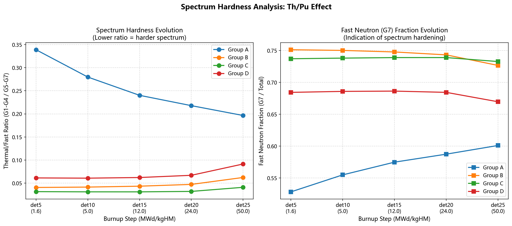
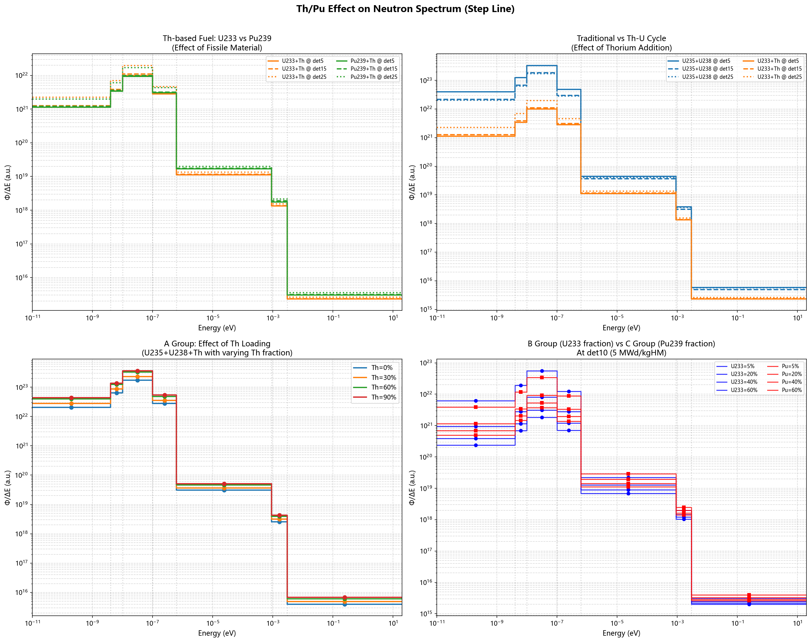
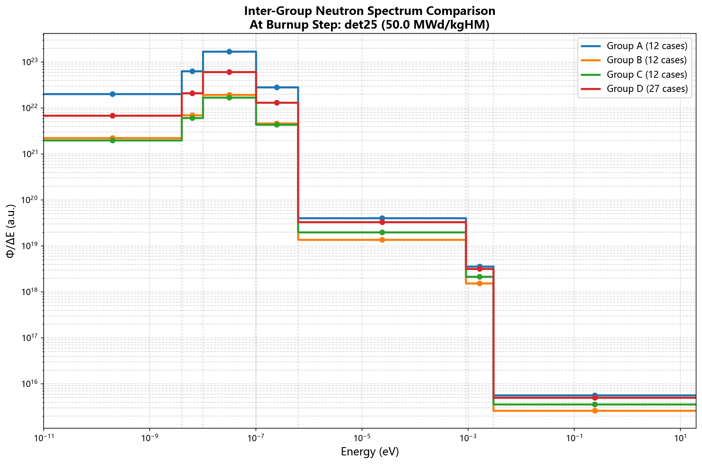
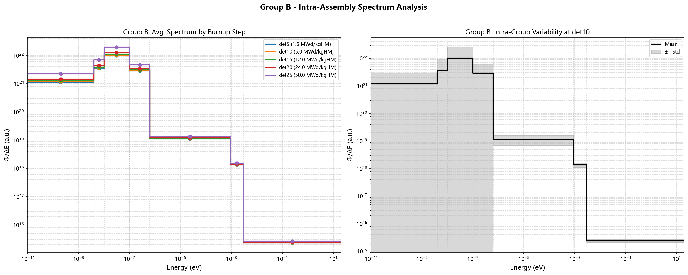

# Serpent_data 能谱工程分析报告（结合图表）

> 数据与图表来源：`/home/runner/work/Serpent_data/Serpent_data/results/analysis` 与 `results/data_processed/*.csv`。

## 1. 工程结论：在 K 约束下的高 CR 候选

### 1.1 结论摘要

- **若采用 `K > 0.9` 约束**：推荐 **D011** 作为“高 CR 且保留反应性”的主候选。  
  - D011: `Th=0.80, Pu=0.04, U235=0.03`  
  - `ANA_KEFF=0.904399`, `CR=0.902881`
- **若采用 `K > 0.8` 约束**：A 组（A010~A012）CR 最高（约 1.047），但 K 较低（约 0.862~0.864），更像“高增殖优先”而不是“反应性裕量优先”。

### 1.2 `K > 0.9` 条件下 CR 领先算例（末燃耗，BURN_STEP=25）

| 排名 | Case | 组别 | Th | Pu | U235 | K | CR |
|---|---|---|---:|---:|---:|---:|---:|
| 1 | D011 | D | 0.80 | 0.04 | 0.03 | 0.904399 | 0.902881 |
| 2 | D001 | D | 0.70 | 0.04 | 0.02 | 0.910702 | 0.889353 |
| 3 | C001 | C | 0.95 | 0.05 | 0.00 | 0.908662 | 0.880412 |
| 4 | D012 | D | 0.80 | 0.04 | 0.05 | 0.919018 | 0.869371 |
| 5 | D002 | D | 0.70 | 0.04 | 0.03 | 0.922200 | 0.863559 |

### 1.3 组级末燃耗统计（BURN_STEP=25）

| 组别 | 样本数 | K均值 | K最小 | K最大 | CR均值 | CR最大 |
|---|---:|---:|---:|---:|---:|---:|
| A | 12 | 0.857897 | 0.798374 | 0.965006 | 0.975678 | 1.047670 |
| B | 12 | 1.749990 | 1.029560 | 2.018480 | 0.202471 | 0.758946 |
| C | 12 | 1.407940 | 0.908662 | 1.682030 | 0.312432 | 0.880412 |
| D | 27 | 0.985604 | 0.881404 | 1.073210 | 0.748135 | 0.954626 |

---

## 2. 能谱结论：加入 Th / Pu 后硬化还是软化

### 2.1 组间对比（同燃耗步）

以 `Thermal/Fast = (G1+G2+G3+G4)/(G5+G6+G7)` 作为硬度指标（**值越小，谱越硬**）：

- det10（5 MWd/kgHM）组均值：
  - A: **0.2798**（最软）
  - B: **0.0414**
  - C: **0.0311**（最硬）
  - D: **0.0608**

结论：相对于 A 组，**引入 Pu 或 U233/Pu 启堆的 B/C/D 组显著硬化**。

### 2.2 随燃耗演化（det5→det25）

- A: `0.3390 → 0.1965`（持续硬化）
- B: `0.0406 → 0.0622`（轻微软化）
- C: `0.0316 → 0.0409`（轻微软化）
- D: `0.0613 → 0.0914`（轻微软化）

补充：G7占比（越高通常越硬）在 A 组上升、在 B/C/D 组略下降，与上述趋势一致。

### 2.3 对应图表

#### 图2-1 组间能谱硬度对比（热/快比 + G7占比）

#### 图2-2 Th/Pu 组间效应（det10）

#### 图2-3 高燃耗组间对比（det25）

---

## 3. 图例与纵坐标说明（报告统一口径）

### 3.1 “组内多个算例的平均能谱”是什么意思

在固定燃耗步（如 det10）下，对组内全部算例（如 A001~A012）逐能群取均值，得到一条“该组代表谱线”。

### 3.2 “组内热/快比一个值概括”是什么意思

先得到组平均谱，再计算：

\[
R_{th/fast}=\frac{G1+G2+G3+G4}{G5+G6+G7}
\]

每个组、每个燃耗步对应一个标量，用于跨组/跨燃耗步比较硬化或软化趋势。

### 3.3 `Φ/ΔE (a.u.)` 是什么

- `Φ`：该能群积分通量；`ΔE`：该能群能宽。  
- `Φ/ΔE` 近似表示单位能量宽度上的通量密度（谱密度），使不同能宽群可直接比较。  
- `a.u.` 表示归一化/相对单位，重点用于比较“谱形”与相对变化，而非绝对反应堆功率量纲。

### 3.4 图例中颜色、线型、组别、燃耗步

- 组内燃耗图：颜色区分 det5/det10/det15/det20/det25。  
- 组间图：颜色区分 A/B/C/D。  
- `intra_assembly_comparison` 右图：黑线是组均值，灰色阴影是该组在该燃耗步的 ±1 标准差范围。

---

## 4. 异常图形说明：B组 `Group_B_intra_assembly_comparison` 阴影偏大

### 4.1 对应图

### 4.2 原因分析（不一定是错误）

1. **组内离散度高**：B组在 det10 的热区（G1~G4）`std/mean` 可达约 `1.1~1.5`，明显大于 D 组。  
2. **阴影是 ±1σ 而不是标准误差**：不做 `sqrt(n)` 缩减，带宽本就会更大。  
3. **样本数量效应**：B组仅12个算例，统计不确定性高于大样本组。  
4. **对数纵轴效应**：低值区的相对波动在 log 坐标上视觉放大。  
5. **`ΔE` 归一化放大窄能群**：阴影按 `std/ΔE` 转换后，窄群视觉更“夸张”。

结论：该阴影更可能反映 **真实的组内分散性 + 绘图尺度效应**，不是直接的绘图错误证据。

---

## 5. 建议补充（若用于工程决策评审）

为增强“可决策性”，建议补两张图：

1. **K-CR 帕累托散点图（det25）**：标出 `K=0.8/0.9` 阈值线，直接读出候选前沿。  
2. **热/快比与G7占比误差棒图**：每个燃耗步给组均值±标准差，强化不确定性表达。

---

## 6. 图表索引

- `results/analysis/Neutron_spectra/inter_assembly/spectrum_hardness_comparison.png`
- `results/analysis/Neutron_spectra/inter_assembly/thPu_effect_comparison.png`
- `results/analysis/Neutron_spectra/inter_assembly/all_groups_inter_comparison_det25.png`
- `results/analysis/Neutron_spectra/intra_assembly/Group_B_intra_assembly_comparison.png`
