# SERPENT 钍基 PWR 算例图形化分析报告

> 数据来源：`results/data_processed/data.csv`（1 638 行，63 个算例）  
> 图表路径：`plots/{CASE}/{图类型}.png`  
> 所有结论均结合数据与图像给出，图注说明图反映的趋势及对高转化比优化的意义。

---

## 0. 可直接用于 agent 的分析提示词

你是一个面向 SERPENT 钍基 PWR 算例数据分析的研究助理。请以当前仓库基线 `main` 为工作基础，读取仓库中已有的全部算例数据与分析脚本，只基于现有数据、现有图像和现有脚本输出进行分析，不要引入仓库外部资料，也不要把未经数据支撑的推断写成结论。

你的任务不是泛泛总结，而是基于数据事实，整理一份面向“未来优化规划”的分析报告。报告需要覆盖以下内容：

1. 中子通量分布曲线的物理含义
   - 说明几个组件主要占据哪个能谱区间的主导地位。
   - 结合中子能谱的软硬变化，解释不同能谱区间对关键核素演化的影响。
   - 说明谱软化或谱硬化会如何改变 Th-U-Pu 转化链、毒物积累、裂变/俘获竞争关系。

2. 转化比提升的定量依据
   - 用图表趋势和数据对比说明：哪些组、哪些参数区间更有利于提高 conversion_ratio。
   - 重点分析 Th_level、U235_enrichment、U233_enrichment、Pu_level 的变化方向与 CR 之间的关系。
   - 不要只给定性判断，要尽量引用表格中的末端值、变化幅度、范围和组间对比，说明为什么这些参数组合更接近高转化比。
   - 给出优化方向：优先改哪些参数、应朝哪个方向移动、哪些区域更适合作为后续 DoE / LHS / 多目标优化的起点。

3. 能谱单值参数化的可行性
   - 讨论是否可以使用单值参数来量化中子能谱的软硬程度，例如 EALF。
   - 说明若引入 EALF，这一指标如何帮助把复杂的能谱信息压缩成便于比较和优化的标量。
   - 分析 EALF 与更高转化比之间可能的关联：例如谱软化是否更有利于 Th232 吸收和 U233 增殖，谱硬化是否更有利于临界性维持或裂变维持。
   - 如果现有数据不足以直接计算 EALF，也要明确说明缺口是什么、需要哪些额外输出、如何在后续脚本中补充。

写作要求：
- 严格基于仓库内的 CSV、图片和分析脚本，不要编造不存在的数值。
- 报告要把“现状观察”和“未来规划”分开：前者是数据结论，后者是基于数据的优化建议。
- 优先使用表格、范围、极值、变化率、组间对比来支撑结论。
- 当不同组的趋势存在冲突时，要明确指出矛盾点，而不是回避。
- 如果某个判断需要更多数据支持，要明确标注为“待验证假设”而不是结论。

建议输出结构：
- 数据来源与分析范围
- 中子通量/能谱区间主导性分析
- 核素演化与能谱软硬关系
- 转化比提升路径与参数优化方向
- EALF 作为单值谱指标的可行性
- 结论与下一步建议

---

## 1. 数据来源与分析口径

| 项目 | 说明 |
|------|------|
| 数据文件 | `results/data_processed/data.csv` |
| 算例数量 | 63 个（A001–A012, B001–B012, C001–C012, D001–D027） |
| 燃耗终点 | ≈50 MWd/kgHM（26 步均匀燃耗） |
| 有效满功率天数（EFPD） | 由 `burnup / POWER_DENSITY` 换算（POWER_DENSITY = 0.038 MW/kgHM） |
| 关键性能指标 | keff（ANA_KEFF）、CR（conversion_ratio）、FIR（可裂变库存比） |
| FIR 定义 | FIR(t) = ΣM_fissile(t) / ΣM_fissile(0)，可裂变核素：U233、U235、Pu239、Pu241 |
| 高转化比判据 | CR末 ≥ 0.9 且 keff末 → 1（双指标联合） |
| `.m` 文件编码 | UTF-8，errors='ignore' |

---

## 2. 全部算例结果罗列

### 2.1 A 组（U235 + Th232 为主燃料，12 个算例）

| Case | keff₀ | keff末 | CR末 | FIR末 | ΔU233 (kg) | ΔTh232 (kg) |
|------|------:|-------:|-----:|------:|-----------:|------------:|
| A001 | 1.2468 | 0.7984 | 0.9827 | 0.340 | +0.000 | +0.000 |
| A002 | 1.3529 | 0.8358 | 0.9002 | 0.286 | +0.000 | +0.000 |
| A003 | 1.4521 | 0.9650 | 0.6773 | 0.350 | +0.001 | +0.000 |
| A004 | 0.9923 | 0.8306 | 1.0261 | 0.820 | +2.432 | −9.373 |
| A005 | 1.1299 | 0.8417 | 0.9965 | 0.582 | +2.437 | −8.390 |
| A006 | 1.2731 | 0.8911 | 0.8833 | 0.450 | +2.450 | −6.778 |
| A007 | 0.6966 | 0.8448 | 1.0461 | 1.761 | +4.305 | −17.537 |
| A008 | 0.8524 | 0.8456 | 1.0400 | 1.185 | +4.295 | −16.540 |
| A009 | 1.0425 | 0.8529 | 1.0145 | 0.742 | +4.273 | −14.656 |
| A010 | 0.2391 | 0.8638 | 1.0468 | 7.929 | +5.975 | −27.170 |
| A011 | 0.3269 | 0.8631 | 1.0470 | 5.279 | +5.969 | −26.817 |
| A012 | 0.4733 | 0.8620 | 1.0477 | 3.162 | +5.960 | −26.125 |

### 2.2 B 组（U233 + Th232 为主燃料，12 个算例）

| Case | keff₀ | keff末 | CR末 | FIR末 | ΔU233 (kg) | ΔTh232 (kg) |
|------|------:|-------:|-----:|------:|-----------:|------------:|
| B001 | 1.5710 | 1.0296 | 0.7589 | 0.441 | −12.703 | −13.378 |
| B002 | 1.7603 | 1.4134 | 0.3620 | 0.579 | −18.829 | −7.283 |
| B003 | 1.8410 | 1.5960 | 0.2483 | 0.690 | −20.721 | −5.421 |
| B004 | 1.8917 | 1.6981 | 0.1968 | 0.756 | −21.683 | −4.465 |
| B005 | 1.9302 | 1.7675 | 0.1650 | 0.799 | −22.311 | −3.829 |
| B006 | 1.9620 | 1.8204 | 0.1423 | 0.829 | −22.777 | −3.346 |
| B007 | 1.9898 | 1.8639 | 0.1244 | 0.851 | −23.150 | −2.951 |
| B008 | 2.0150 | 1.9012 | 0.1094 | 0.867 | −23.465 | −2.613 |
| B009 | 2.0383 | 1.9344 | 0.0965 | 0.881 | −23.738 | −2.313 |
| B010 | 2.0600 | 1.9645 | 0.0852 | 0.891 | −23.980 | −2.045 |
| B011 | 2.0805 | 1.9925 | 0.0750 | 0.900 | −24.198 | −1.800 |
| B012 | 2.1002 | 2.0185 | 0.0656 | 0.908 | −24.398 | −1.573 |

### 2.3 C 组（Pu239 + Th232 为主燃料，12 个算例）

| Case | keff₀ | keff末 | CR末 | FIR末 | ΔU233 (kg) | ΔTh232 (kg) |
|------|------:|-------:|-----:|------:|-----------:|------------:|
| C001 | 1.4504 | 0.9087 | 0.8804 | 0.378 | +5.941 | −13.094 |
| C002 | 1.5447 | 1.1329 | 0.5020 | 0.533 | +5.249 | −8.482 |
| C003 | 1.6007 | 1.2380 | 0.3949 | 0.653 | +4.689 | −6.953 |
| C004 | 1.6456 | 1.3124 | 0.3352 | 0.724 | +4.229 | −5.991 |
| C005 | 1.6848 | 1.3740 | 0.2927 | 0.771 | +3.829 | −5.259 |
| C006 | 1.7207 | 1.4281 | 0.2593 | 0.803 | +3.471 | −4.658 |
| C007 | 1.7540 | 1.4777 | 0.2315 | 0.827 | +3.144 | −4.143 |
| C008 | 1.7855 | 1.5233 | 0.2079 | 0.846 | +2.843 | −3.689 |
| C009 | 1.8156 | 1.5662 | 0.1872 | 0.861 | +2.564 | −3.284 |
| C010 | 1.8443 | 1.6067 | 0.1687 | 0.873 | +2.302 | −2.915 |
| C011 | 1.8719 | 1.6452 | 0.1522 | 0.883 | +2.056 | −2.577 |
| C012 | 1.8987 | 1.6820 | 0.1372 | 0.892 | +1.822 | −2.263 |

### 2.4 D 组（Pu239 + U235 + Th232 混合燃料，27 个算例）

| Case | keff₀ | keff末 | CR末 | FIR末 | ΔU233 (kg) | ΔTh232 (kg) |
|------|------:|-------:|-----:|------:|-----------:|------------:|
| D001 | 1.3533 | 0.9107 | 0.8894 | 0.471 | +4.897 | −10.521 |
| D002 | 1.3586 | 0.9222 | 0.8636 | 0.473 | +4.878 | −10.244 |
| D003 | 1.3688 | 0.9451 | 0.8149 | 0.481 | +4.837 | −9.750 |
| D004 | 1.4052 | 0.9916 | 0.7328 | 0.497 | +4.794 | −8.673 |
| D005 | 1.4083 | 1.0002 | 0.7167 | 0.504 | +4.772 | −8.541 |
| D006 | 1.4145 | 1.0165 | 0.6868 | 0.519 | +4.728 | −8.295 |
| D007 | 1.4419 | 1.0563 | 0.6292 | 0.551 | +4.653 | −7.704 |
| D008 | 1.4441 | 1.0620 | 0.6195 | 0.558 | +4.635 | −7.628 |
| D009 | 1.4482 | 1.0732 | 0.6009 | 0.569 | +4.596 | −7.481 |
| D010 | 1.3533 | 0.8971 | 0.9199 | 0.465 | +5.413 | −12.047 |
| D011 | 1.3569 | 0.9044 | 0.9029 | 0.465 | +5.399 | −11.831 |
| D012 | 1.3638 | 0.9190 | 0.8694 | 0.466 | +5.372 | −11.432 |
| D013 | 1.4100 | 0.9829 | 0.7451 | 0.478 | +5.282 | −9.739 |
| D014 | 1.4121 | 0.9884 | 0.7346 | 0.483 | +5.268 | −9.645 |
| D015 | 1.4160 | 0.9989 | 0.7143 | 0.491 | +5.238 | −9.465 |
| D016 | 1.4500 | 1.0537 | 0.6279 | 0.532 | +5.111 | −8.565 |
| D017 | 1.4512 | 1.0571 | 0.6220 | 0.536 | +5.100 | −8.516 |
| D018 | 1.4537 | 1.0638 | 0.6107 | 0.543 | +5.076 | −8.419 |
| D019 | 1.3648 | 0.8814 | 0.9546 | 0.450 | +5.887 | −13.829 |
| D020 | 1.3664 | 0.8841 | 0.9485 | 0.448 | +5.881 | −13.724 |
| D021 | 1.3695 | 0.8896 | 0.9345 | 0.446 | +5.871 | −13.523 |
| D022 | 1.4312 | 0.9745 | 0.7535 | 0.442 | +5.723 | −10.872 |
| D023 | 1.4320 | 0.9764 | 0.7496 | 0.443 | +5.718 | −10.838 |
| D024 | 1.4335 | 0.9800 | 0.7424 | 0.445 | +5.708 | −10.772 |
| D025 | 1.4830 | 1.0599 | 0.6069 | 0.491 | +5.500 | −9.403 |
| D026 | 1.4834 | 1.0605 | 0.6059 | 0.492 | +5.497 | −9.392 |
| D027 | 1.4840 | 1.0619 | 0.6033 | 0.493 | +5.492 | −9.373 |

---

## 3. 分组总结

| 组 | 算例数 | keff₀ 范围 | keff末范围 | CR末范围 | FIR末范围 | 主要特征 |
|----|-------:|-----------|-----------|---------|---------|---------|
| A | 12 | 0.239–1.452 | 0.798–0.965 | 0.677–1.048 | 0.286–7.929 | 高 Th 比例时 CR>1，但全组 keff末<1 |
| B | 12 | 1.571–2.100 | 1.030–2.018 | 0.066–0.759 | 0.441–0.908 | 临界维持最好，CR 随 U233 增多而快速下降 |
| C | 12 | 1.450–1.899 | 0.909–1.682 | 0.137–0.880 | 0.378–0.892 | C001 高转化，其余反应性充裕但 CR 低 |
| D | 27 | 1.353–1.484 | 0.881–1.073 | 0.601–0.955 | 0.442–0.569 | 三变量折中，高 Th 区 CR 接近 0.95 |

**关键发现：** 在全部 63 个算例中，**没有任何一个算例同时满足 CR末≥0.9 且 keff末≥1.0**。这是钍基 PWR 优化中最核心的矛盾点。

---

## 4. 每组材料成分范围建议

### A 组（U235-Th 体系）
- 高 CR 采样区：**Th_level 0.70–0.90，U235_enrichment 0.02–0.05**（对应 A007–A012）
- 理由：该区域 CR末 稳定在 1.04–1.05，U233 增殖量 4–6 kg，但 keff 初值仅 0.24–0.70，需要辅助措施（如可燃毒物或启动源）

### B 组（U233-Th 体系）
- 高转化折中区：**Th_level 0.80–0.90，U233_enrichment 0.05–0.15**（对应 B001–B003）
- 理由：B001 是唯一 keff末接近 1.0 且 CR 尚可（0.76）的案例，值得精细采样

### C 组（Pu-Th 体系）
- 转化与临界折中：**Th_level 0.80–0.90，Pu_level 0.05–0.10**（对应 C001–C003）
- 理由：C001 转化最好（CR=0.88），C002 是高 Th 情况下能保临界的最低 Pu 配方

### D 组（Pu-U235-Th 三元体系）
- 高转化区：**Th 0.85–0.90，Pu 0.04–0.05，U235 0.02–0.03**（对应 D019–D021）
- 临界维持区：**Th 0.70–0.75，Pu 0.06–0.07，U235 0.04–0.05**（对应 D004–D006）
- 理由：D 组提供 CR 与 keff 的连续权衡面，是后续 DoE/LHS 采样的主战场

---

## 5. 优化方向

1. **主矛盾**：CR 提升必然伴随 keff 末端下降；没有任何现有算例同时满足 CR>0.9 且 keff末≥1.0。
2. **推荐优化路径**：
   - 以 D 组为基底，在"高 Th、低 Pu、低 U235"区域建立 Pareto 前沿；
   - 采用多目标优化（Pareto-NSGA-II 或加权目标函数）探索 CR/keff 权衡边界；
   - A 组作为纯 Th 转化机理研究平台，用于验证增殖能力上限；
   - B 组 B001–B003 可用于验证 U233 驱动的临界性恢复机制。
3. **敏感性分析变量优先级**（基于各组 CR/keff 变化幅度）：
   1. Th_level（全局最关键，贯穿所有组）
   2. U233_enrichment（B 组核心参数）
   3. Pu_level（C/D 组）
   4. U235_enrichment（A/D 组）
   5. Th × Pu 交互项（D 组）

---

## 6. 图表结果展示

> **图片路径说明**：所有图片保存在 `plots/{CASE}/` 目录下。  
> 每类图文件名固定，共六类（见下表）。

| 图类型 | 文件名 | 描述 |
|--------|--------|------|
| 燃耗-反应性 | `keff_fir_cr.png` | keff、FIR、CR 随燃耗变化（3 子图） |
| 关键核素原子数密度 | `inventory_vs_efpd.png` | U233/Th232/Pa233/U235/U238 Adens 随 EFPD 变化 |
| 中子毒物演化 | `poison_evolution.png` | Sm149/Xe135 质量密度与原子数密度随燃耗变化 |
| 裂变/吸收比 | `fission_absorption_ratio.png` | 各核素裂变率/俘获率比值随燃耗变化 |
| 核素质量密度（燃耗） | `mass_evolution.png` | 8 种核素质量密度随燃耗变化（对数坐标） |
| 核素质量密度（EFPD） | `mass_density_vs_efpd.png` | 8 种核素质量密度随 EFPD 变化（对数坐标） |

---

### 6.1 A 组代表算例图表

#### A001（低 Th，基准 U235，无 Th 转化）

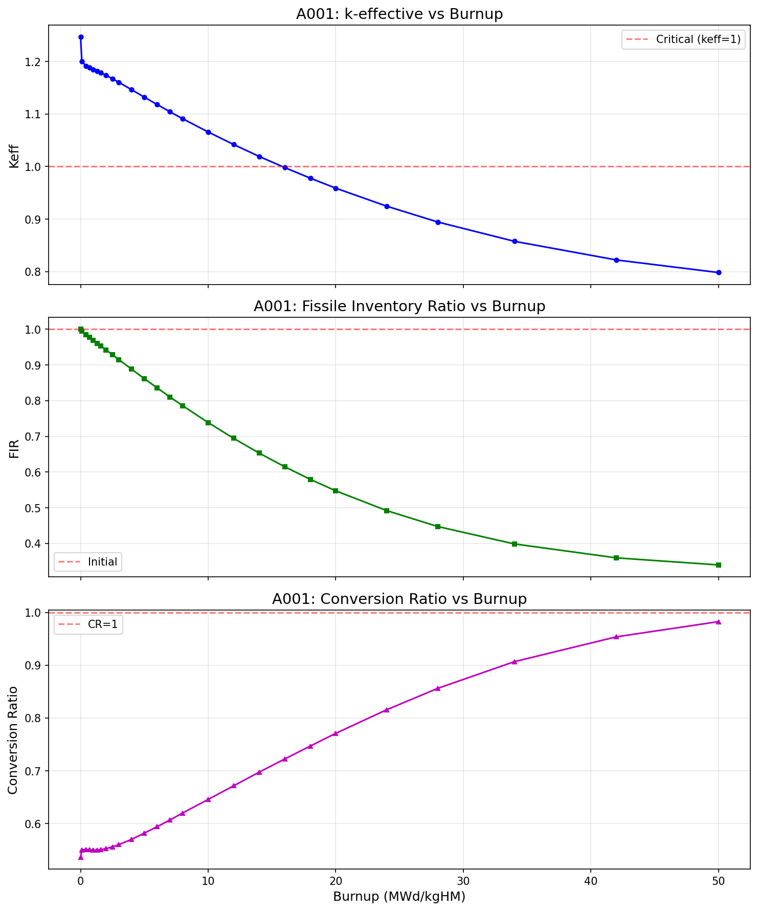

**证据表**
- 图名：A001 keff-FIR-CR
- 使用字段：ANA_KEFF, conversion_ratio, Mdens_U233, Mdens_U235, Mdens_Pu239, Mdens_Pu241
- 公式或计算口径：Keff/CR 直接取 CSV；FIR(t) = (Mdens_U233 + Mdens_U235 + Mdens_Pu239 + Mdens_Pu241)_t / 同一和式在步 0 的初值；横轴为 burnup_MWd_kgHM。
- 关键点数值：

| 序列 | 趋势方向 | x_start | y_start | x_end | y_end | y_max | y_min | 拐点位置 / 变化最快区间 |
|------|----------|---------|---------|-------|-------|-------|-------|------------------------|
| KEFF | 下降 | 0 | 1.2468 | 50.0002 | 0.7984 | 1.2468 @ 0 | 0.7984 @ 50.0002 | 无 / 0→0.1000 |
| FIR | 下降 | 0 | 1.0000 | 50.0002 | 0.3398 | 1.0000 @ 0 | 0.3398 @ 50.0002 | 无 / 0→0.1000 |
| CR | 波动 | 0 | 0.5360 | 50.0002 | 0.9827 | 0.9827 @ 50.0002 | 0.5360 @ 0 | 0.4000 / 0→0.1000 |

- 与图片视觉趋势一致性检查结果：通过（现有 `plots/A001/keff_fir_cr.png` 与按 `results/script/analyze_data.py` 和 `results/data_processed/data.csv` 重绘结果逐像素一致，未发现版本冲突）

> **图注**：A001 的 keff 单调下降，从 1.2468 降到 0.7984；FIR 也从 1.0000 降到 0.3398；CR 则从 0.5360 升到 0.9827，最快变化集中在 0–0.1000 MWd/kgHM。这说明该无 Th 基线虽然末端 CR 接近 1，但 keff 末端仅 0.7984、FIR 末端仅 0.3398，仍不能满足末端临界与可裂变库存保持的联合优化目标。

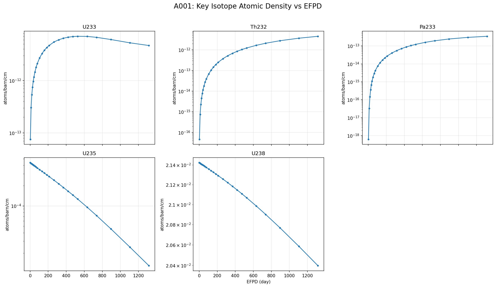

**证据表**
- 图名：A001 核素库存
- 使用字段：Adens_U233, Adens_Th232, Adens_Pa233, Adens_U235, Adens_U238
- 公式或计算口径：直接使用 EFPD 与 KEY_ADENS = [Adens_U233, Adens_Th232, Adens_Pa233, Adens_U235, Adens_U238]；脚本仅绘制大于 0 的点并使用对数纵轴。
- 关键点数值：

| 序列 | 趋势方向 | x_start | y_start | x_end | y_end | y_max | y_min | 拐点位置 / 变化最快区间 |
|------|----------|---------|---------|-------|-------|-------|-------|------------------------|
| Adens_U233 | 先升后降 | 0 | 0 | 1315.7947 | 4.6845e-12 | 7.0257e-12 @ 526.3184 | 0 @ 0 | 526.3184 / 10.5263→18.4211 |
| Adens_Th232 | 上升 | 0 | 0 | 1315.7947 | 4.5756e-12 | 4.5756e-12 @ 1315.7947 | 0 @ 0 | 无 / 736.8447→894.7395 |
| Adens_Pa233 | 上升 | 0 | 0 | 1315.7947 | 3.4626e-13 | 3.4626e-13 @ 1315.7947 | 0 @ 0 | 无 / 526.3184→631.5816 |
| Adens_U235 | 下降 | 0 | 4.3719e-04 | 1315.7947 | 1.3002e-05 | 4.3719e-04 @ 0 | 1.3002e-05 @ 1315.7947 | 无 / 0→2.6316 |
| Adens_U238 | 下降 | 0 | 0.0214 | 1315.7947 | 0.0204 | 0.0214 @ 0 | 0.0204 @ 1315.7947 | 无 / 1105.2684→1315.7947 |

- 与图片视觉趋势一致性检查结果：通过（现有 `plots/A001/inventory_vs_efpd.png` 与按 `results/script/analyze_data.py` 和 `results/data_processed/data.csv` 重绘结果逐像素一致，未发现版本冲突）

> **图注**：A001 的可见主趋势只有 U235 和 U238：U235 从 4.3719e-04 单调降到 1.3002e-05，U238 从 0.0214 缓降到 0.0204。U233、Th232 和 Pa233 全程仅在 10^-12–10^-13 量级，较 U235/U238 低 8–10 个数量级，在图像上近似贴近零线。因此该算例没有形成可见的 Th→Pa→U233 增殖链，无法依靠转化提升末端 keff 或 FIR。

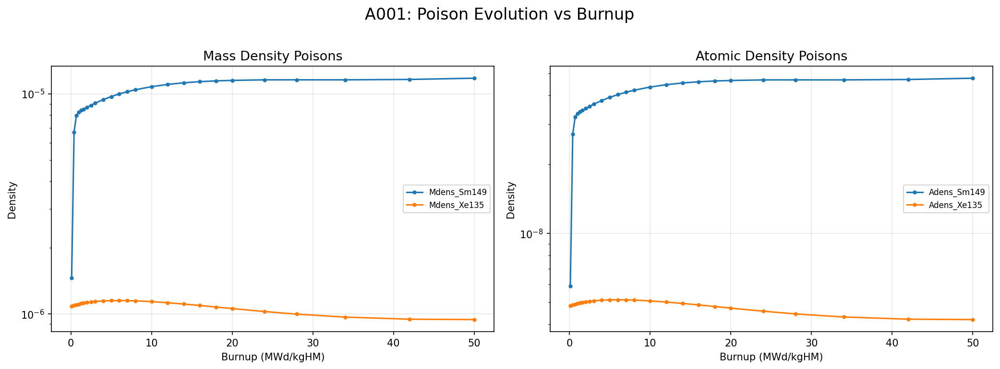

**证据表**
- 图名：A001 毒物演化
- 使用字段：Mdens_Sm149, Mdens_Xe135, Adens_Sm149, Adens_Xe135
- 公式或计算口径：直接使用 burnup_MWd_kgHM 与 [Mdens_Sm149, Mdens_Xe135, Adens_Sm149, Adens_Xe135]；脚本仅绘制大于 0 的点并使用对数纵轴。
- 关键点数值：

| 序列 | 趋势方向 | x_start | y_start | x_end | y_end | y_max | y_min | 拐点位置 / 变化最快区间 |
|------|----------|---------|---------|-------|-------|-------|-------|------------------------|
| Mdens_Sm149 | 波动 | 0 | 0 | 50.0002 | 1.1763e-05 | 1.1763e-05 @ 50.0002 | 0 @ 0 | 28.0001 / 0.1000→0.4000 |
| Mdens_Xe135 | 先升后降 | 0 | 0 | 50.0002 | 9.4222e-07 | 1.1499e-06 @ 6.0000 | 0 @ 0 | 6.0000 / 0→0.1000 |
| Adens_Sm149 | 波动 | 0 | 0 | 50.0002 | 4.7567e-08 | 4.7567e-08 @ 50.0002 | 0 @ 0 | 28.0001 / 0.1000→0.4000 |
| Adens_Xe135 | 先升后降 | 0 | 0 | 50.0002 | 4.2059e-09 | 5.1330e-09 @ 6.0000 | 0 @ 0 | 6.0000 / 0→0.1000 |

- 与图片视觉趋势一致性检查结果：通过（现有 `plots/A001/poison_evolution.png` 与按 `results/script/analyze_data.py` 和 `results/data_processed/data.csv` 重绘结果逐像素一致，未发现版本冲突）

> **图注**：A001 中 Sm149 质量密度在 0.1000–0.4000 MWd/kgHM 增长最快，末端达到 1.1763e-05；Xe135 在 6.0000 MWd/kgHM 达到峰值 1.1499e-06，随后回落到末端 9.4222e-07。原子数密度子图保持同一趋势。末端两种毒物都保持非零库存，会继续压缩 A001 已降到 0.7984 的 keff 裕量。

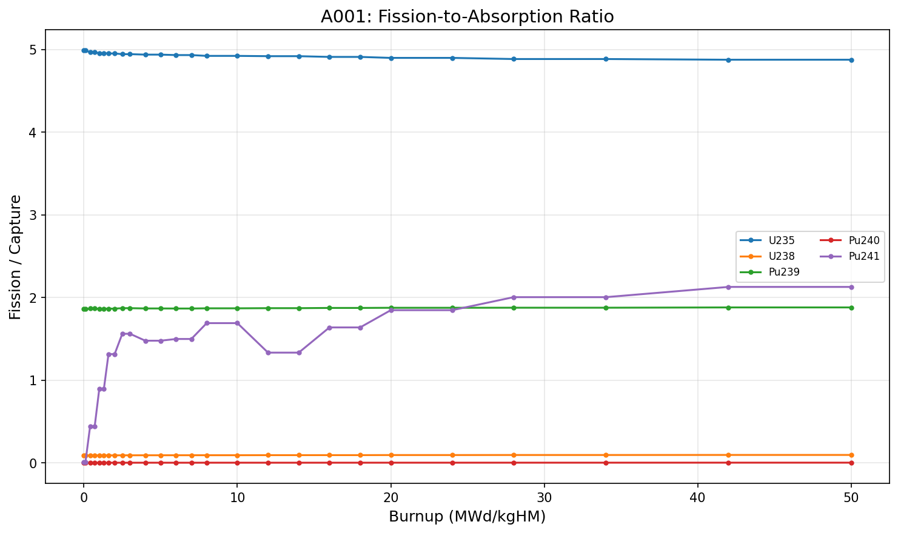

**证据表**
- 图名：A001 裂变/吸收比
- 使用字段：U235_FISS/U235_CAPT, U238_FISS/U238_CAPT, PU239_FISS/PU239_CAPT, PU240_FISS/PU240_CAPT, PU241_FISS/PU241_CAPT
- 公式或计算口径：对每个核素按 ratio = FISS / CAPT.replace(0, NaN) 复算；横轴为 burnup_MWd_kgHM；若分母为 0 或整列无有限值，则图中无线。
- 关键点数值：

| 序列 | 趋势方向 | x_start | y_start | x_end | y_end | y_max | y_min | 拐点位置 / 变化最快区间 |
|------|----------|---------|---------|-------|-------|-------|-------|------------------------|
| U235 | 下降 | 0 | 4.9889 | 50.0002 | 4.8749 | 4.9889 @ 0 | 4.8749 @ 42.0002 | 无 / 0.1000→0.4000 |
| U238 | 上升 | 0 | 0.0895 | 50.0002 | 0.0962 | 0.0962 @ 42.0002 | 0.0895 @ 0 | 无 / 0.1000→0.4000 |
| Pu239 | 波动 | 0 | 1.8587 | 50.0002 | 1.8799 | 1.8799 @ 42.0002 | 1.8587 @ 0 | 0.1000 / 0.1000→0.4000 |
| Pu240 | 波动 | 0 | 0.0017 | 50.0002 | 0.0029 | 0.0029 @ 42.0002 | 0.0017 @ 0 | 0.7000 / 0.1000→0.4000 |
| Pu241 | 波动 | 0 | 0.0117 | 50.0002 | 2.1278 | 2.1278 @ 42.0002 | 0.0117 @ 0 | 1.0000 / 0.7000→1.0000 |

- 与图片视觉趋势一致性检查结果：通过（现有 `plots/A001/fission_absorption_ratio.png` 与按 `results/script/analyze_data.py` 和 `results/data_processed/data.csv` 重绘结果逐像素一致，未发现版本冲突）

> **图注**：A001 图中的主导比值是 U235：其裂变/俘获比从 4.9889 缓降到 4.8749。U238 仅从 0.0895 升到 0.0962；次生 Pu239、Pu240、Pu241 的比值虽可计算，但末端分别仅为 1.8799、0.0029 和 2.1278。该图支持的结论是 U 循环主导仍未改变，因此若要同时改善末端 CR 和 keff，优化重点应放在引入 Th 转化通道，而不是依赖次生 Pu 比值。

---

#### A007（高 Th，低 U235，最高增殖代表）

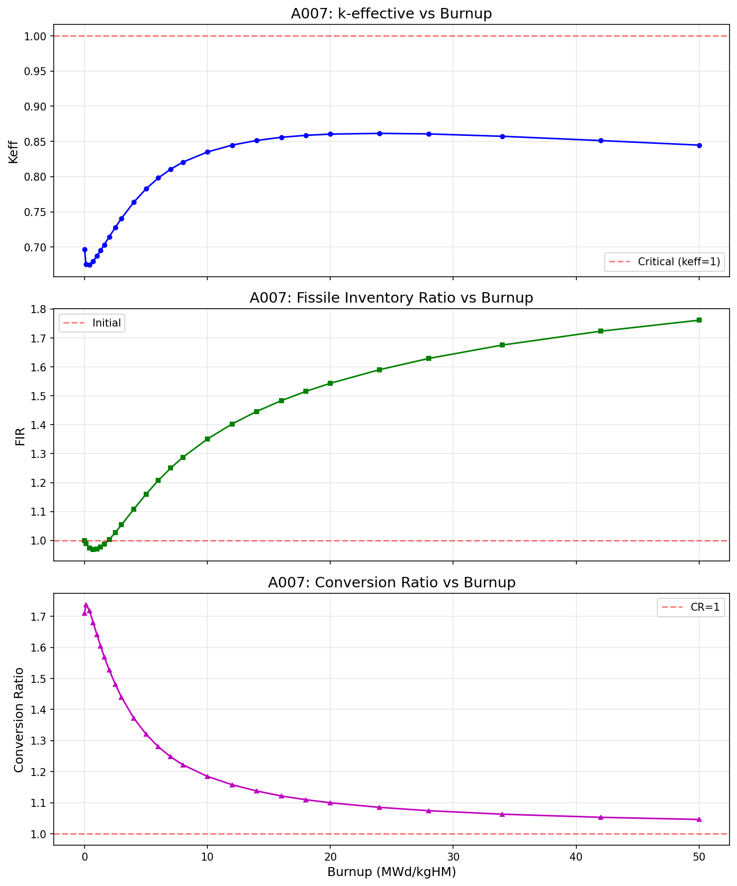

**证据表**
- 图名：A007 keff-FIR-CR
- 使用字段：ANA_KEFF, conversion_ratio, Mdens_U233, Mdens_U235, Mdens_Pu239, Mdens_Pu241
- 公式或计算口径：Keff/CR 直接取 CSV；FIR(t) = (Mdens_U233 + Mdens_U235 + Mdens_Pu239 + Mdens_Pu241)_t / 同一和式在步 0 的初值；横轴为 burnup_MWd_kgHM。
- 关键点数值：

| 序列 | 趋势方向 | x_start | y_start | x_end | y_end | y_max | y_min | 拐点位置 / 变化最快区间 |
|------|----------|---------|---------|-------|-------|-------|-------|------------------------|
| KEFF | 波动 | 0 | 0.6966 | 50.0002 | 0.8448 | 0.8615 @ 24.0001 | 0.6745 @ 0.4000 | 0.4000 / 0→0.1000 |
| FIR | 先降后升 | 0 | 1.0000 | 50.0002 | 1.7614 | 1.7614 @ 50.0002 | 0.9690 @ 0.7000 | 0.7000 / 0→0.1000 |
| CR | 先升后降 | 0 | 1.7099 | 50.0002 | 1.0461 | 1.7378 @ 0.1000 | 1.0461 @ 50.0002 | 0.1000 / 0→0.1000 |

- 与图片视觉趋势一致性检查结果：通过（现有 `plots/A007/keff_fir_cr.png` 与按 `results/script/analyze_data.py` 和 `results/data_processed/data.csv` 重绘结果逐像素一致，未发现版本冲突）

> **图注**：A007 的 keff 不是单调上升，而是先从 0.6966 降到 0.6745（0.4000 MWd/kgHM），再升到 0.8615（24.0000 MWd/kgHM），末端回落到 0.8448。FIR 先在 0.7000 MWd/kgHM 降到 0.9690，随后持续升到 1.7614；CR 在 0.1000 MWd/kgHM 达峰 1.7380，之后持续降到 1.0461。这说明 A007 已实现净增殖（FIR>1），但 keff 末端仍低于 1，因此只能满足增殖目标，不能满足末端临界目标。

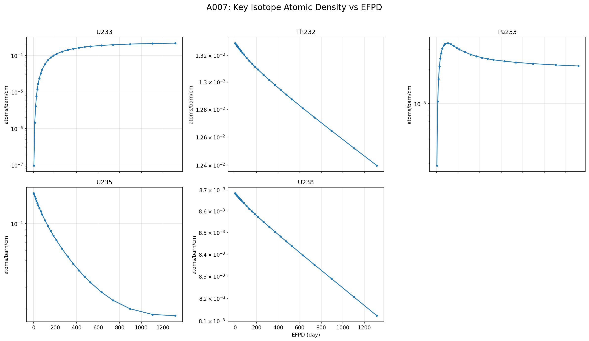

**证据表**
- 图名：A007 核素库存
- 使用字段：Adens_U233, Adens_Th232, Adens_Pa233, Adens_U235, Adens_U238
- 公式或计算口径：直接使用 EFPD 与 KEY_ADENS = [Adens_U233, Adens_Th232, Adens_Pa233, Adens_U235, Adens_U238]；脚本仅绘制大于 0 的点并使用对数纵轴。
- 关键点数值：

| 序列 | 趋势方向 | x_start | y_start | x_end | y_end | y_max | y_min | 拐点位置 / 变化最快区间 |
|------|----------|---------|---------|-------|-------|-------|-------|------------------------|
| Adens_U233 | 上升 | 0 | 0 | 1315.7947 | 2.1862e-04 | 2.1862e-04 @ 1315.7947 | 0 @ 0 | 无 / 65.7897→78.9476 |
| Adens_Th232 | 下降 | 0 | 0.0133 | 1315.7947 | 0.0124 | 0.0133 @ 0 | 0.0124 @ 1315.7947 | 无 / 2.6316→10.5264 |
| Adens_Pa233 | 先升后降 | 0 | 0 | 1315.7947 | 2.1438e-05 | 3.4018e-05 @ 105.2637 | 0 @ 0 | 105.2637 / 0→2.6316 |
| Adens_U235 | 下降 | 0 | 1.7722e-04 | 1315.7947 | 1.7508e-05 | 1.7722e-04 @ 0 | 1.7508e-05 @ 1315.7947 | 无 / 0→2.6316 |
| Adens_U238 | 下降 | 0 | 0.0087 | 1315.7947 | 0.0081 | 0.0087 @ 0 | 0.0081 @ 1315.7947 | 无 / 2.6316→10.5264 |

- 与图片视觉趋势一致性检查结果：通过（现有 `plots/A007/inventory_vs_efpd.png` 与按 `results/script/analyze_data.py` 和 `results/data_processed/data.csv` 重绘结果逐像素一致，未发现版本冲突）

> **图注**：A007 的 U233 从 0 持续升到 2.1862e-04，Th232 从 0.0133 降到 0.0124，Pa233 在 105.2632 EFPD 达峰 3.4018e-05 后回落到 2.1438e-05。同时 U235 从 1.7722e-04 降到 1.7508e-05。图像与数据共同表明 Th→Pa→U233 转化链已经建立，并支撑 FIR 末端升到 1.7614；但这条转化链仍不足以把 keff 末端抬回 1.0000 以上。

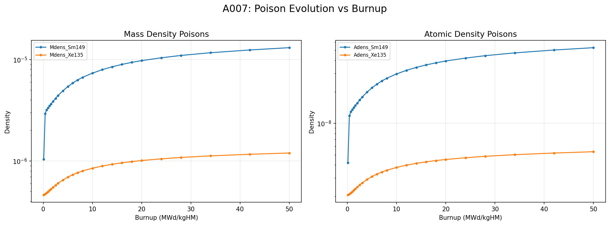

**证据表**
- 图名：A007 毒物演化
- 使用字段：Mdens_Sm149, Mdens_Xe135, Adens_Sm149, Adens_Xe135
- 公式或计算口径：直接使用 burnup_MWd_kgHM 与 [Mdens_Sm149, Mdens_Xe135, Adens_Sm149, Adens_Xe135]；脚本仅绘制大于 0 的点并使用对数纵轴。
- 关键点数值：

| 序列 | 趋势方向 | x_start | y_start | x_end | y_end | y_max | y_min | 拐点位置 / 变化最快区间 |
|------|----------|---------|---------|-------|-------|-------|-------|------------------------|
| Mdens_Sm149 | 上升 | 0 | 0 | 50.0002 | 1.3084e-05 | 1.3084e-05 @ 50.0002 | 0 @ 0 | 无 / 0→0.1000 |
| Mdens_Xe135 | 上升 | 0 | 0 | 50.0002 | 1.1988e-06 | 1.1988e-06 @ 50.0002 | 0 @ 0 | 无 / 0→0.1000 |
| Adens_Sm149 | 上升 | 0 | 0 | 50.0002 | 5.2910e-08 | 5.2910e-08 @ 50.0002 | 0 @ 0 | 无 / 0→0.1000 |
| Adens_Xe135 | 上升 | 0 | 0 | 50.0002 | 5.3512e-09 | 5.3512e-09 @ 50.0002 | 0 @ 0 | 无 / 0→0.1000 |

- 与图片视觉趋势一致性检查结果：通过（现有 `plots/A007/poison_evolution.png` 与按 `results/script/analyze_data.py` 和 `results/data_processed/data.csv` 重绘结果逐像素一致，未发现版本冲突）

> **图注**：A007 的 Sm149 与 Xe135 在质量密度和原子数密度两张子图中都呈单调上升，且最快增长都出现在 0–0.1000 MWd/kgHM。末端 Mdens_Sm149 和 Mdens_Xe135 分别达到 1.3084e-05 与 1.1988e-06，对应的末端原子数密度分别为 5.2910e-08 与 5.3512e-09。由于 A007 的 keff 末端只有 0.8448，这些持续累积的毒物会进一步压缩末端反应性裕量。

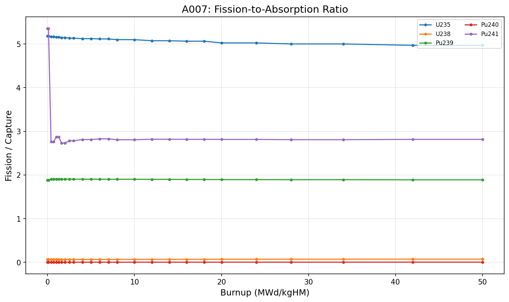

**证据表**
- 图名：A007 裂变/吸收比
- 使用字段：U235_FISS/U235_CAPT, U238_FISS/U238_CAPT, PU239_FISS/PU239_CAPT, PU240_FISS/PU240_CAPT, PU241_FISS/PU241_CAPT
- 公式或计算口径：对每个核素按 ratio = FISS / CAPT.replace(0, NaN) 复算；横轴为 burnup_MWd_kgHM；若分母为 0 或整列无有限值，则图中无线。
- 关键点数值：

| 序列 | 趋势方向 | x_start | y_start | x_end | y_end | y_max | y_min | 拐点位置 / 变化最快区间 |
|------|----------|---------|---------|-------|-------|-------|-------|------------------------|
| U235 | 下降 | 0 | 5.1834 | 50.0002 | 4.9690 | 5.1834 @ 0 | 4.9690 @ 42.0002 | 无 / 0.1000→0.4000 |
| U238 | 上升 | 0 | 0.0623 | 50.0002 | 0.0721 | 0.0721 @ 42.0002 | 0.0623 @ 0 | 无 / 1.3000→1.6000 |
| Pu239 | 波动 | 0 | 1.8837 | 50.0002 | 1.8885 | 1.9039 @ 1.0000 | 1.8837 @ 0 | 0.4000 / 0.1000→0.4000 |
| Pu240 | 波动 | 0 | 0.0020 | 50.0002 | 0.0029 | 0.0029 @ 42.0002 | 0.0019 @ 1.6000 | 0.1000 / 1.3000→1.6000 |
| Pu241 | 波动 | 0 | 5.3539 | 50.0002 | 2.8145 | 5.3539 @ 0 | 2.7296 @ 1.6000 | 0.1000 / 0.1000→0.4000 |

- 与图片视觉趋势一致性检查结果：通过（现有 `plots/A007/fission_absorption_ratio.png` 与按 `results/script/analyze_data.py` 和 `results/data_processed/data.csv` 重绘结果逐像素一致，未发现版本冲突）

> **图注**：A007 的裂变/俘获比图并不包含 U233 曲线；按脚本口径，图中只有 U235、U238、Pu239、Pu240 和 Pu241。其中 U235 从 5.1834 降到 4.9690，U238 从 0.0623 升到 0.0721，Pu241 从 5.3539 降到 2.8145，Pu239 和 Pu240 只在窄范围内波动。因此本图能支持的优化结论仅是：A007 的高 CR 与高 FIR 并不是由图中某条新比值曲线突然抬升驱动，而是来自整体增殖链累积；仅凭本图不能声称 U233 已接管裂变主导。

---

### 6.2 B 组代表算例图表

#### B001（最低 U233 初装，最接近折中点）

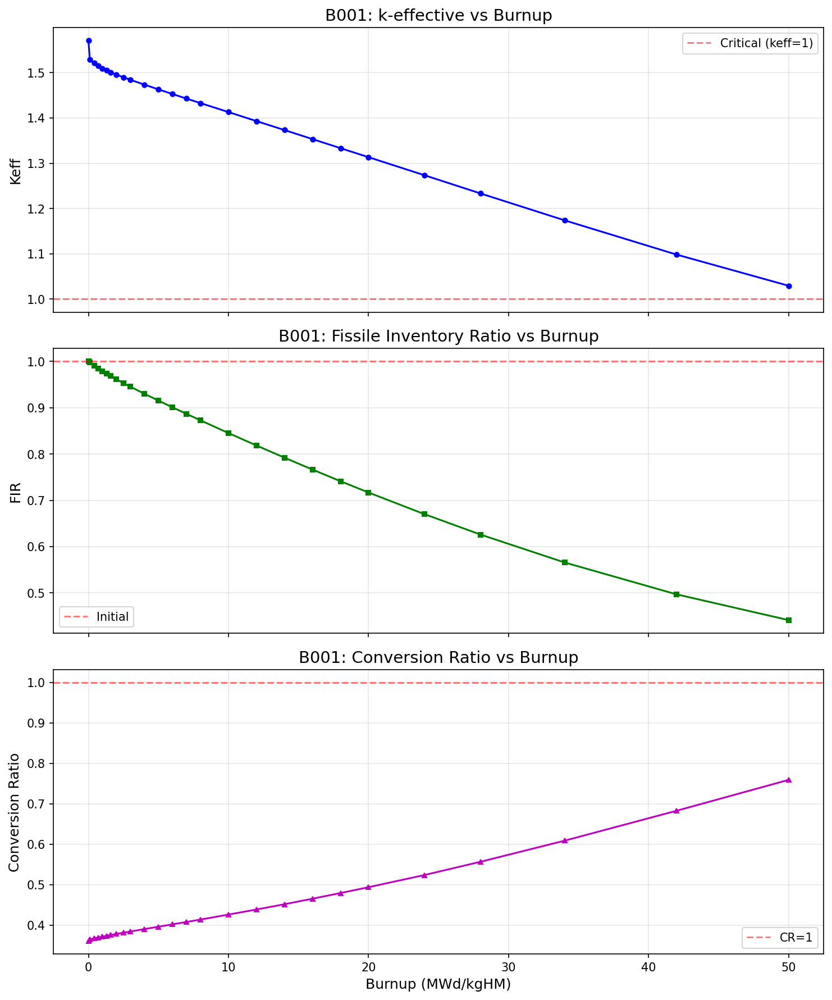

**证据表**
- 图名：B001 keff-FIR-CR
- 使用字段：ANA_KEFF, conversion_ratio, Mdens_U233, Mdens_U235, Mdens_Pu239, Mdens_Pu241
- 公式或计算口径：Keff/CR 直接取 CSV；FIR(t) = (Mdens_U233 + Mdens_U235 + Mdens_Pu239 + Mdens_Pu241)_t / 同一和式在步 0 的初值；横轴为 burnup_MWd_kgHM。
- 关键点数值：

| 序列 | 趋势方向 | x_start | y_start | x_end | y_end | y_max | y_min | 拐点位置 / 变化最快区间 |
|------|----------|---------|---------|-------|-------|-------|-------|------------------------|
| KEFF | 下降 | 0 | 1.5710 | 50.0002 | 1.0296 | 1.5710 @ 0 | 1.0296 @ 50.0002 | 无 / 0→0.1000 |
| FIR | 下降 | 0 | 1.0000 | 50.0002 | 0.4412 | 1.0000 @ 0 | 0.4412 @ 50.0002 | 无 / 0→0.1000 |
| CR | 上升 | 0 | 0.3605 | 50.0002 | 0.7589 | 0.7589 @ 50.0002 | 0.3605 @ 0 | 无 / 0→0.1000 |

- 与图片视觉趋势一致性检查结果：通过（现有 `plots/B001/keff_fir_cr.png` 与按 `results/script/analyze_data.py` 和 `results/data_processed/data.csv` 重绘结果逐像素一致，未发现版本冲突）

> **图注**：B001 的 keff 从 1.5710 单调降到 1.0296，FIR 从 1.0000 降到 0.4412，而 CR 从 0.3605 持续升到 0.7589。三条曲线的最快变化都发生在 0–0.1000 MWd/kgHM。该算例在末端保住了 keff>1，但 CR 末端只有 0.7589，仍未达到 CR≥0.9000 的高转化目标。

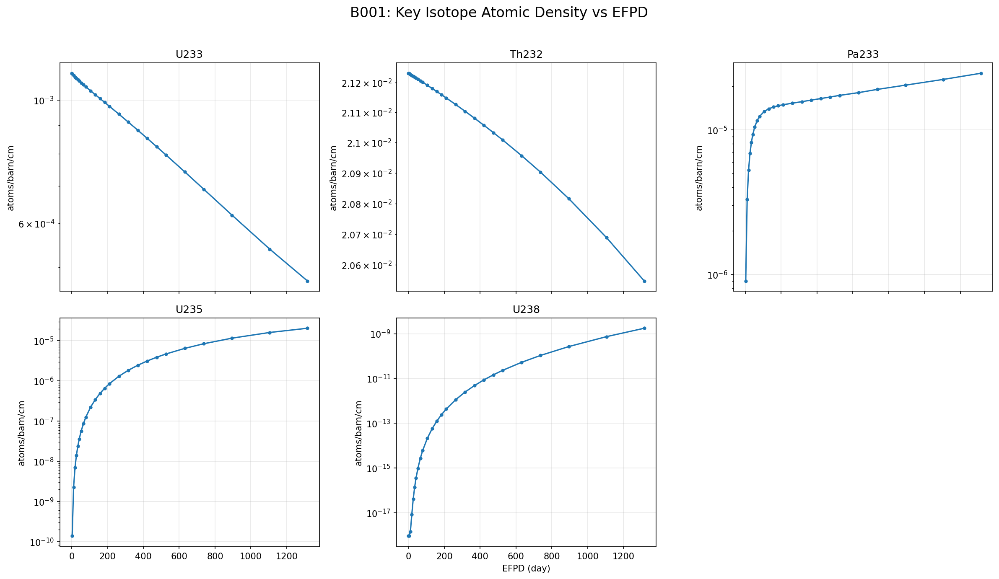

**证据表**
- 图名：B001 核素库存
- 使用字段：Adens_U233, Adens_Th232, Adens_Pa233, Adens_U235, Adens_U238
- 公式或计算口径：直接使用 EFPD 与 KEY_ADENS = [Adens_U233, Adens_Th232, Adens_Pa233, Adens_U235, Adens_U238]；脚本仅绘制大于 0 的点并使用对数纵轴。
- 关键点数值：

| 序列 | 趋势方向 | x_start | y_start | x_end | y_end | y_max | y_min | 拐点位置 / 变化最快区间 |
|------|----------|---------|---------|-------|-------|-------|-------|------------------------|
| Adens_U233 | 下降 | 0 | 0.0011 | 1315.7947 | 4.7235e-04 | 0.0011 @ 0 | 4.7235e-04 @ 1315.7947 | 无 / 0→2.6316 |
| Adens_Th232 | 下降 | 0 | 0.0212 | 1315.7947 | 0.0205 | 0.0212 @ 0 | 0.0205 @ 1315.7947 | 无 / 1105.2658→1315.7947 |
| Adens_Pa233 | 上升 | 0 | 0 | 1315.7947 | 2.4674e-05 | 2.4674e-05 @ 1315.7947 | 0 @ 0 | 无 / 0→2.6316 |
| Adens_U235 | 上升 | 0 | 0 | 1315.7947 | 2.0516e-05 | 2.0516e-05 @ 1315.7947 | 0 @ 0 | 无 / 894.7395→1105.2658 |
| Adens_U238 | 上升 | 0 | 9.3042e-19 | 1315.7947 | 1.7575e-09 | 1.7575e-09 @ 1315.7947 | 9.3042e-19 @ 0 | 无 / 1105.2658→1315.7947 |

- 与图片视觉趋势一致性检查结果：通过（现有 `plots/B001/inventory_vs_efpd.png` 与按 `results/script/analyze_data.py` 和 `results/data_processed/data.csv` 重绘结果逐像素一致，未发现版本冲突）

> **图注**：B001 中初装 U233 从 0.0011 持续降到 4.7235e-04，Th232 从 0.0212 缓降到 0.0205。Pa233 从 0 单调升到 2.4674e-05，新生 U235 也从 0 升到 2.0516e-05。这说明 B001 存在转化产物生成，但其规模不足以抵消初装 U233 的消耗，因此 FIR 末端只剩 0.4412。

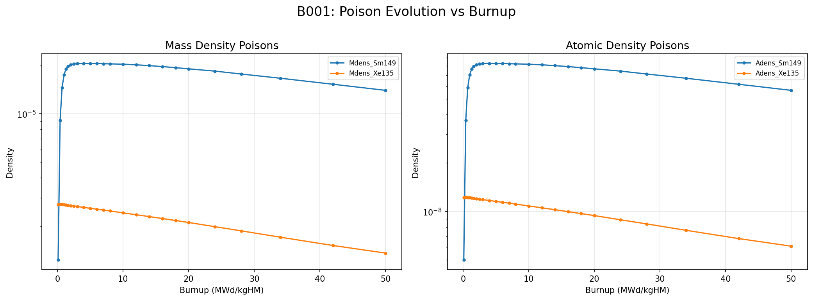

**证据表**
- 图名：B001 毒物演化
- 使用字段：Mdens_Sm149, Mdens_Xe135, Adens_Sm149, Adens_Xe135
- 公式或计算口径：直接使用 burnup_MWd_kgHM 与 [Mdens_Sm149, Mdens_Xe135, Adens_Sm149, Adens_Xe135]；脚本仅绘制大于 0 的点并使用对数纵轴。
- 关键点数值：

| 序列 | 趋势方向 | x_start | y_start | x_end | y_end | y_max | y_min | 拐点位置 / 变化最快区间 |
|------|----------|---------|---------|-------|-------|-------|-------|------------------------|
| Mdens_Sm149 | 先升后降 | 0 | 0 | 50.0002 | 1.3971e-05 | 2.0485e-05 @ 4.0000 | 0 @ 0 | 4.0000 / 0.1000→0.4000 |
| Mdens_Xe135 | 先升后降 | 0 | 0 | 50.0002 | 1.3625e-06 | 2.7476e-06 @ 0.4000 | 0 @ 0 | 0.4000 / 0→0.1000 |
| Adens_Sm149 | 先升后降 | 0 | 0 | 50.0002 | 5.6496e-08 | 8.2841e-08 @ 4.0000 | 0 @ 0 | 4.0000 / 0.1000→0.4000 |
| Adens_Xe135 | 先升后降 | 0 | 0 | 50.0002 | 6.0822e-09 | 1.2265e-08 @ 0.4000 | 0 @ 0 | 0.4000 / 0→0.1000 |

- 与图片视觉趋势一致性检查结果：通过（现有 `plots/B001/poison_evolution.png` 与按 `results/script/analyze_data.py` 和 `results/data_processed/data.csv` 重绘结果逐像素一致，未发现版本冲突）

> **图注**：B001 的毒物图呈明显先升后降：Mdens_Xe135 在 0.4000 MWd/kgHM 达峰 2.7476e-06，末端回落到 1.3625e-06；Mdens_Sm149 在 4.0000 MWd/kgHM 达峰 2.0485e-05，末端为 1.3971e-05。原子数密度子图同样在 0.4000 和 4.0000 MWd/kgHM 给出对应峰值。因为 B001 末端 keff 只有 1.0296，这些末端残余毒物仍会压缩其本就有限的临界裕量。

---

#### B006（U233 浓度中等，CR-keff 权衡的中间点）

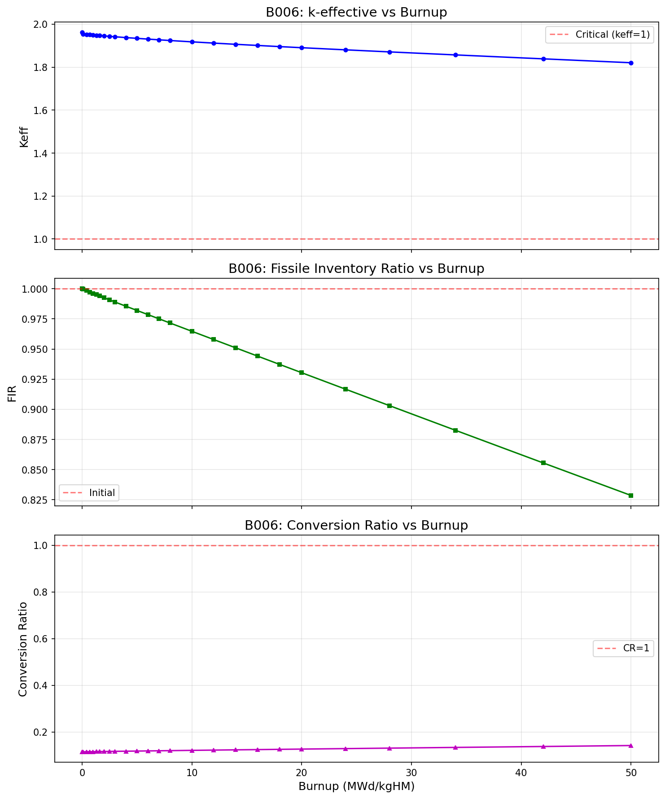

**证据表**
- 图名：B006 keff-FIR-CR
- 使用字段：ANA_KEFF, conversion_ratio, Mdens_U233, Mdens_U235, Mdens_Pu239, Mdens_Pu241
- 公式或计算口径：Keff/CR 直接取 CSV；FIR(t) = (Mdens_U233 + Mdens_U235 + Mdens_Pu239 + Mdens_Pu241)_t / 同一和式在步 0 的初值；横轴为 burnup_MWd_kgHM。
- 关键点数值：

| 序列 | 趋势方向 | x_start | y_start | x_end | y_end | y_max | y_min | 拐点位置 / 变化最快区间 |
|------|----------|---------|---------|-------|-------|-------|-------|------------------------|
| KEFF | 下降 | 0 | 1.9620 | 50.0001 | 1.8204 | 1.9620 @ 0 | 1.8204 @ 50.0001 | 无 / 0→0.1000 |
| FIR | 下降 | 0 | 1.0000 | 50.0001 | 0.8285 | 1.0000 @ 0 | 0.8285 @ 50.0001 | 无 / 0→0.1000 |
| CR | 上升 | 0 | 0.1151 | 50.0001 | 0.1423 | 0.1423 @ 50.0001 | 0.1151 @ 0 | 无 / 0→0.1000 |

- 与图片视觉趋势一致性检查结果：通过（现有 `plots/B006/keff_fir_cr.png` 与按 `results/script/analyze_data.py` 和 `results/data_processed/data.csv` 重绘结果逐像素一致，未发现版本冲突）

> **图注**：B006 的 keff 从 1.9620 降到 1.8204，FIR 从 1.0000 降到 0.8285，CR 仅从 0.1151 小幅升到 0.1423。最快变化同样集中在 0–0.1000 MWd/kgHM。该算例显然满足末端 keff>1，但 CR 全程都低于 0.1500，因此与高转化目标相距很远。

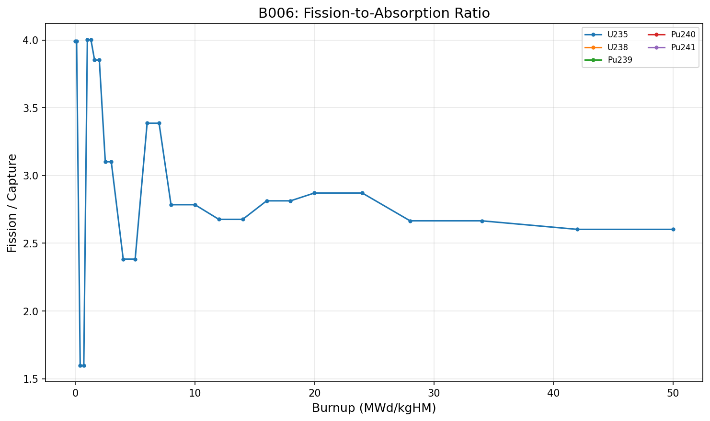

**证据表**
- 图名：B006 裂变/吸收比
- 使用字段：U235_FISS/U235_CAPT, U238_FISS/U238_CAPT, PU239_FISS/PU239_CAPT, PU240_FISS/PU240_CAPT, PU241_FISS/PU241_CAPT
- 公式或计算口径：对每个核素按 ratio = FISS / CAPT.replace(0, NaN) 复算；横轴为 burnup_MWd_kgHM；若分母为 0 或整列无有限值，则图中无线。
- 关键点数值：

| 序列 | 趋势方向 | x_start | y_start | x_end | y_end | y_max | y_min | 拐点位置 / 变化最快区间 |
|------|----------|---------|---------|-------|-------|-------|-------|------------------------|
| U235 | 波动 | 0 | 3.9908 | 50.0001 | 2.6024 | 4.0021 @ 1.0000 | 1.5974 @ 0.4000 | 0.1000 / 0.7000→1.0000 |
| U238 | 证据不足 | — | — | — | — | — | — | 无有效点 |
| Pu239 | 证据不足 | — | — | — | — | — | — | 无有效点 |
| Pu240 | 证据不足 | — | — | — | — | — | — | 无有效点 |
| Pu241 | 证据不足 | — | — | — | — | — | — | 无有效点 |

- 与图片视觉趋势一致性检查结果：通过（现有 `plots/B006/fission_absorption_ratio.png` 与按 `results/script/analyze_data.py` 和 `results/data_processed/data.csv` 重绘结果逐像素一致，未发现版本冲突）

> **图注**：按脚本口径复算后，B006 的裂变/俘获比图只有 U235 一条有效曲线：其比值从 3.9908 变化到 2.6024，并在 0.4000 MWd/kgHM 处出现最小值 1.5974。U238、Pu239、Pu240、Pu241 在当前数据口径下均无有限比值，因此图中无线。所以该图只能支持 U235 俘获竞争增强的结论，不能支持多核素接管或转化增强的结论；这与 B006 的低 CR 末端值 0.1423 一致。

---

### 6.3 C 组代表算例图表

#### C001（最低 Pu，最高转化，代表高转化边界）

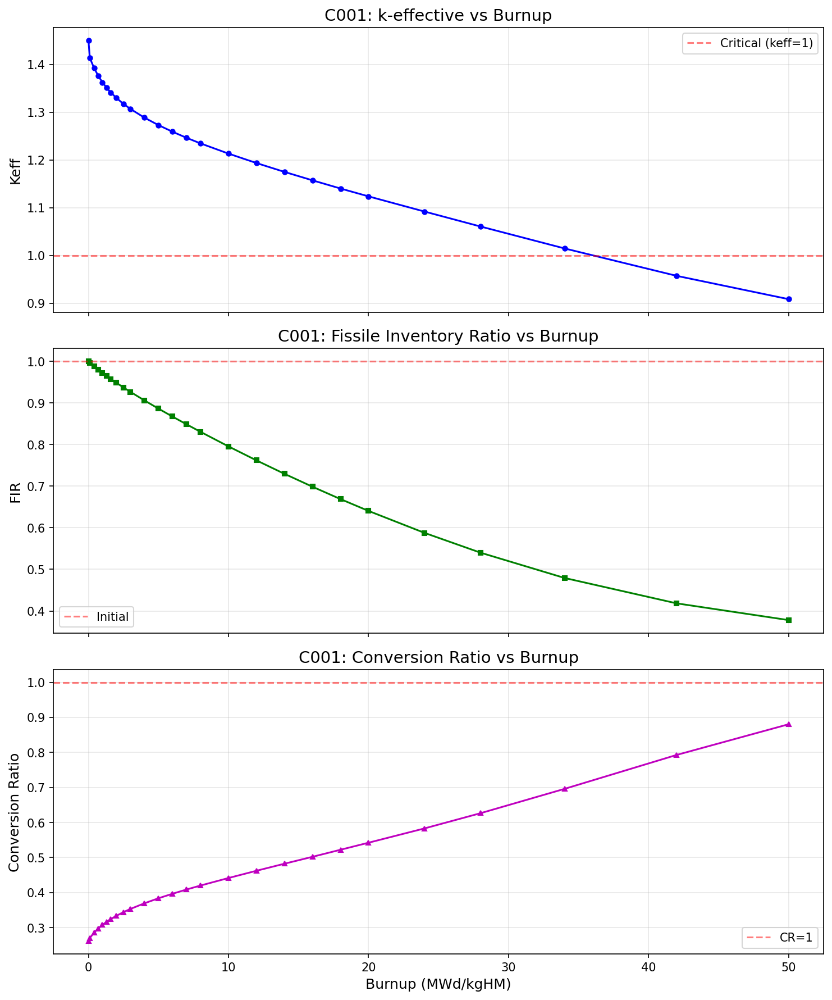

**证据表**
- 图名：C001 keff-FIR-CR
- 使用字段：ANA_KEFF, conversion_ratio, Mdens_U233, Mdens_U235, Mdens_Pu239, Mdens_Pu241
- 公式或计算口径：Keff/CR 直接取 CSV；FIR(t) = (Mdens_U233 + Mdens_U235 + Mdens_Pu239 + Mdens_Pu241)_t / 同一和式在步 0 的初值；横轴为 burnup_MWd_kgHM。
- 关键点数值：

| 序列 | 趋势方向 | x_start | y_start | x_end | y_end | y_max | y_min | 拐点位置 / 变化最快区间 |
|------|----------|---------|---------|-------|-------|-------|-------|------------------------|
| KEFF | 下降 | 0 | 1.4504 | 50.0002 | 0.9087 | 1.4504 @ 0 | 0.9087 @ 50.0002 | 无 / 0→0.1000 |
| FIR | 下降 | 0 | 1.0000 | 50.0002 | 0.3780 | 1.0000 @ 0 | 0.3780 @ 50.0002 | 无 / 0→0.1000 |
| CR | 上升 | 0 | 0.2615 | 50.0002 | 0.8804 | 0.8804 @ 50.0002 | 0.2615 @ 0 | 无 / 0→0.1000 |

- 与图片视觉趋势一致性检查结果：通过（现有 `plots/C001/keff_fir_cr.png` 与按 `results/script/analyze_data.py` 和 `results/data_processed/data.csv` 重绘结果逐像素一致，未发现版本冲突）

> **图注**：C001 的 keff 从 1.4504 单调降到 0.9087，FIR 从 1.0000 降到 0.3780，CR 则从 0.2615 持续升到 0.8804。虽然末端 CR 已接近 0.9000，但末端 keff 只有 0.9087，说明该高转化边界点仍无法同时满足临界与转化双目标。

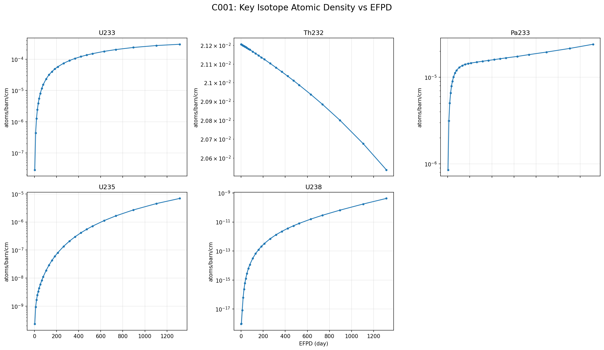

**证据表**
- 图名：C001 核素库存
- 使用字段：Adens_U233, Adens_Th232, Adens_Pa233, Adens_U235, Adens_U238
- 公式或计算口径：直接使用 EFPD 与 KEY_ADENS = [Adens_U233, Adens_Th232, Adens_Pa233, Adens_U235, Adens_U238]；脚本仅绘制大于 0 的点并使用对数纵轴。
- 关键点数值：

| 序列 | 趋势方向 | x_start | y_start | x_end | y_end | y_max | y_min | 拐点位置 / 变化最快区间 |
|------|----------|---------|---------|-------|-------|-------|-------|------------------------|
| Adens_U233 | 上升 | 0 | 0 | 1315.7947 | 3.0167e-04 | 3.0167e-04 @ 1315.7947 | 0 @ 0 | 无 / 157.8953→184.2111 |
| Adens_Th232 | 下降 | 0 | 0.0212 | 1315.7947 | 0.0205 | 0.0212 @ 0 | 0.0205 @ 1315.7947 | 无 / 1105.2658→1315.7947 |
| Adens_Pa233 | 上升 | 0 | 0 | 1315.7947 | 2.3997e-05 | 2.3997e-05 @ 1315.7947 | 0 @ 0 | 无 / 0→2.6316 |
| Adens_U235 | 上升 | 0 | 0 | 1315.7947 | 6.9269e-06 | 6.9269e-06 @ 1315.7947 | 0 @ 0 | 无 / 1105.2658→1315.7947 |
| Adens_U238 | 上升 | 0 | 9.2936e-19 | 1315.7947 | 4.2267e-10 | 4.2267e-10 @ 1315.7947 | 9.2936e-19 @ 0 | 无 / 1105.2658→1315.7947 |

- 与图片视觉趋势一致性检查结果：通过（现有 `plots/C001/inventory_vs_efpd.png` 与按 `results/script/analyze_data.py` 和 `results/data_processed/data.csv` 重绘结果逐像素一致，未发现版本冲突）

> **图注**：C001 的 U233 从 0 持续升到 3.0167e-04，Th232 从 0.0212 降到 0.0205，Pa233 从 0 升到 2.3997e-05。同时新生 U235 在后段升到 6.9269e-06，U238 也从近零升到 4.2267e-10。这组趋势说明 C001 的 Th→U233 转化确实最强，但新增可裂变库存仍不足以阻止 keff 末端跌破 1.0000。

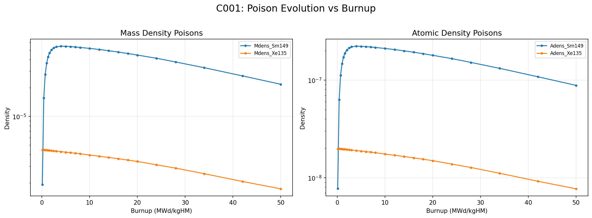

**证据表**
- 图名：C001 毒物演化
- 使用字段：Mdens_Sm149, Mdens_Xe135, Adens_Sm149, Adens_Xe135
- 公式或计算口径：直接使用 burnup_MWd_kgHM 与 [Mdens_Sm149, Mdens_Xe135, Adens_Sm149, Adens_Xe135]；脚本仅绘制大于 0 的点并使用对数纵轴。
- 关键点数值：

| 序列 | 趋势方向 | x_start | y_start | x_end | y_end | y_max | y_min | 拐点位置 / 变化最快区间 |
|------|----------|---------|---------|-------|-------|-------|-------|------------------------|
| Mdens_Sm149 | 先升后降 | 0 | 0 | 50.0002 | 2.1840e-05 | 5.4985e-05 @ 4.0000 | 0 @ 0 | 4.0000 / 0.1000→0.4000 |
| Mdens_Xe135 | 先升后降 | 0 | 0 | 50.0002 | 1.7278e-06 | 4.4461e-06 @ 0.4000 | 0 @ 0 | 0.4000 / 0→0.1000 |
| Adens_Sm149 | 先升后降 | 0 | 0 | 50.0002 | 8.8318e-08 | 2.2235e-07 @ 4.0000 | 0 @ 0 | 4.0000 / 0.1000→0.4000 |
| Adens_Xe135 | 先升后降 | 0 | 0 | 50.0002 | 7.7125e-09 | 1.9847e-08 @ 0.4000 | 0 @ 0 | 0.4000 / 0→0.1000 |

- 与图片视觉趋势一致性检查结果：通过（现有 `plots/C001/poison_evolution.png` 与按 `results/script/analyze_data.py` 和 `results/data_processed/data.csv` 重绘结果逐像素一致，未发现版本冲突）

> **图注**：C001 的 Xe135 在 0.4000 MWd/kgHM 达峰 4.4461e-06，Sm149 在 4.0000 MWd/kgHM 达峰 5.4985e-05，之后二者都回落到末端 1.7278e-06 与 2.1840e-05。原子数密度子图给出同样的峰位。因为 C001 末端 keff 仅 0.9087，这些早期形成并持续存在的毒物库存会进一步削弱末端临界性。

---

#### C002（最低 Pu 中仍能维持临界，关键临界转折点）

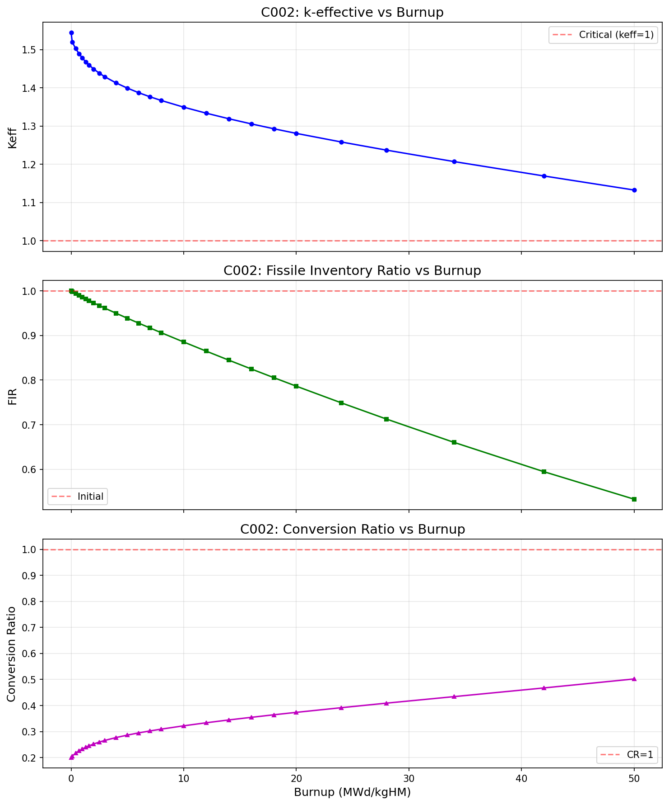

**证据表**
- 图名：C002 keff-FIR-CR
- 使用字段：ANA_KEFF, conversion_ratio, Mdens_U233, Mdens_U235, Mdens_Pu239, Mdens_Pu241
- 公式或计算口径：Keff/CR 直接取 CSV；FIR(t) = (Mdens_U233 + Mdens_U235 + Mdens_Pu239 + Mdens_Pu241)_t / 同一和式在步 0 的初值；横轴为 burnup_MWd_kgHM。
- 关键点数值：

| 序列 | 趋势方向 | x_start | y_start | x_end | y_end | y_max | y_min | 拐点位置 / 变化最快区间 |
|------|----------|---------|---------|-------|-------|-------|-------|------------------------|
| KEFF | 下降 | 0 | 1.5447 | 50.0001 | 1.1328 | 1.5447 @ 0 | 1.1328 @ 50.0001 | 无 / 0→0.1000 |
| FIR | 下降 | 0 | 1.0000 | 50.0001 | 0.5328 | 1.0000 @ 0 | 0.5328 @ 50.0001 | 无 / 0→0.1000 |
| CR | 上升 | 0 | 0.2001 | 50.0001 | 0.5020 | 0.5020 @ 50.0001 | 0.2001 @ 0 | 无 / 0→0.1000 |

- 与图片视觉趋势一致性检查结果：通过（现有 `plots/C002/keff_fir_cr.png` 与按 `results/script/analyze_data.py` 和 `results/data_processed/data.csv` 重绘结果逐像素一致，未发现版本冲突）

> **图注**：C002 的 keff 从 1.5447 降到 1.1328，FIR 从 1.0000 降到 0.5328，CR 从 0.2001 升到 0.5020。与 C001 相比，它保住了末端 keff>1，但末端 CR 只有 0.5020。因此 C002 只能作为保临界但牺牲转化的折中点，不能作为同时满足 CR≥0.9000 与 keff≥1.0000 的解。

---

### 6.4 D 组代表算例图表

#### D005（接近临界且 CR 适中，三元体系最佳折中点之一）

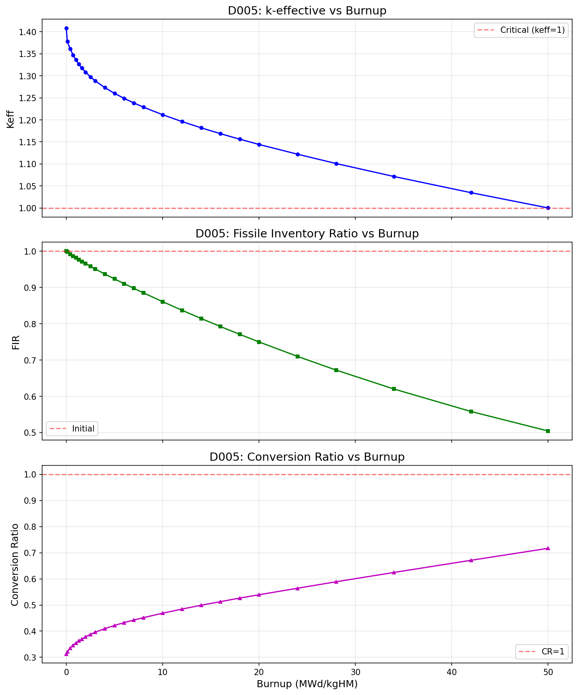

**证据表**
- 图名：D005 keff-FIR-CR
- 使用字段：ANA_KEFF, conversion_ratio, Mdens_U233, Mdens_U235, Mdens_Pu239, Mdens_Pu241
- 公式或计算口径：Keff/CR 直接取 CSV；FIR(t) = (Mdens_U233 + Mdens_U235 + Mdens_Pu239 + Mdens_Pu241)_t / 同一和式在步 0 的初值；横轴为 burnup_MWd_kgHM。
- 关键点数值：

| 序列 | 趋势方向 | x_start | y_start | x_end | y_end | y_max | y_min | 拐点位置 / 变化最快区间 |
|------|----------|---------|---------|-------|-------|-------|-------|------------------------|
| KEFF | 下降 | 0 | 1.4083 | 50.0002 | 1.0002 | 1.4083 @ 0 | 1.0002 @ 50.0002 | 无 / 0→0.1000 |
| FIR | 下降 | 0 | 1.0000 | 50.0002 | 0.5045 | 1.0000 @ 0 | 0.5045 @ 50.0002 | 无 / 0→0.1000 |
| CR | 上升 | 0 | 0.3126 | 50.0002 | 0.7167 | 0.7167 @ 50.0002 | 0.3126 @ 0 | 无 / 0→0.1000 |

- 与图片视觉趋势一致性检查结果：通过（现有 `plots/D005/keff_fir_cr.png` 与按 `results/script/analyze_data.py` 和 `results/data_processed/data.csv` 重绘结果逐像素一致，未发现版本冲突）

> **图注**：D005 的 keff 从 1.4083 单调降到 1.0002，FIR 从 1.0000 降到 0.5045，CR 从 0.3126 升到 0.7167。末端 keff 接近 1.0000，但 CR 末端仍低于 0.9000。所以 D005 的数据支持接近 EOL 临界的结论，但不支持高转化达标的结论。

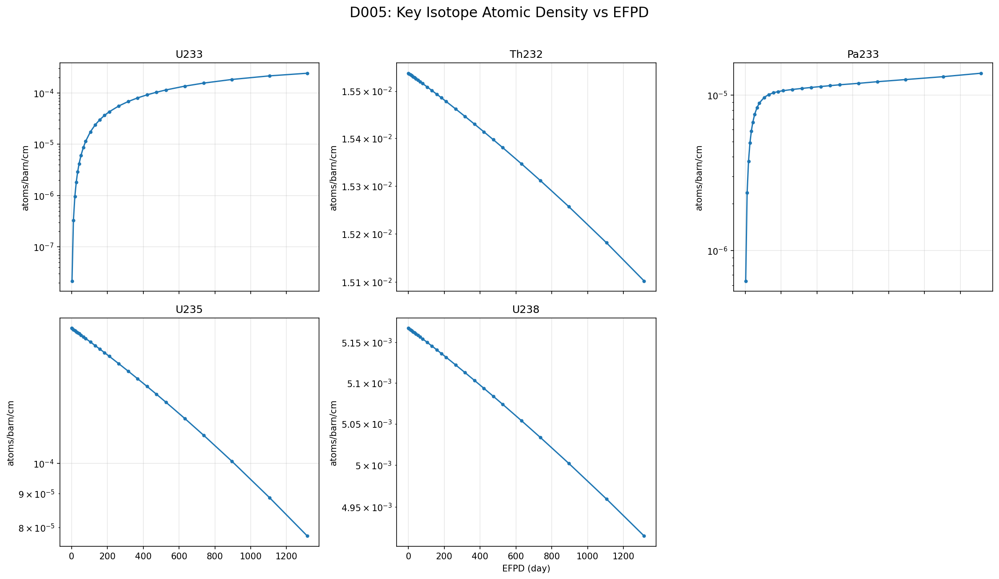

**证据表**
- 图名：D005 核素库存
- 使用字段：Adens_U233, Adens_Th232, Adens_Pa233, Adens_U235, Adens_U238
- 公式或计算口径：直接使用 EFPD 与 KEY_ADENS = [Adens_U233, Adens_Th232, Adens_Pa233, Adens_U235, Adens_U238]；脚本仅绘制大于 0 的点并使用对数纵轴。
- 关键点数值：

| 序列 | 趋势方向 | x_start | y_start | x_end | y_end | y_max | y_min | 拐点位置 / 变化最快区间 |
|------|----------|---------|---------|-------|-------|-------|-------|------------------------|
| Adens_U233 | 上升 | 0 | 0 | 1315.7947 | 2.4233e-04 | 2.4233e-04 @ 1315.7947 | 0 @ 0 | 无 / 157.8953→184.2111 |
| Adens_Th232 | 下降 | 0 | 0.0155 | 1315.7947 | 0.0151 | 0.0155 @ 0 | 0.0151 @ 1315.7947 | 无 / 1105.2658→1315.7947 |
| Adens_Pa233 | 上升 | 0 | 0 | 1315.7947 | 1.3789e-05 | 1.3789e-05 @ 1315.7947 | 0 @ 0 | 无 / 0→2.6316 |
| Adens_U235 | 下降 | 0 | 1.5982e-04 | 1315.7947 | 7.7716e-05 | 1.5982e-04 @ 0 | 7.7716e-05 @ 1315.7947 | 无 / 26.3158→34.2105 |
| Adens_U238 | 下降 | 0 | 0.0052 | 1315.7947 | 0.0049 | 0.0052 @ 0 | 0.0049 @ 1315.7947 | 无 / 1105.2658→1315.7947 |

- 与图片视觉趋势一致性检查结果：通过（现有 `plots/D005/inventory_vs_efpd.png` 与按 `results/script/analyze_data.py` 和 `results/data_processed/data.csv` 重绘结果逐像素一致，未发现版本冲突）

> **图注**：D005 中 U233 从 0 持续升到 2.4233e-04，Th232 从 0.0155 降到 0.0151，Pa233 从 0 升到 1.3789e-05。与此同时，U235 从 1.5982e-04 降到 7.7716e-05，U238 也缓降到 0.0049。这说明 D005 的三元体系确实存在持续转化，但转化强度只够把 CR 末端推到 0.7167，还不足以越过 0.9000 门槛。

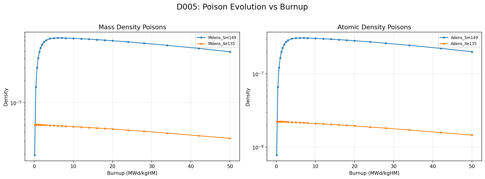

**证据表**
- 图名：D005 毒物演化
- 使用字段：Mdens_Sm149, Mdens_Xe135, Adens_Sm149, Adens_Xe135
- 公式或计算口径：直接使用 burnup_MWd_kgHM 与 [Mdens_Sm149, Mdens_Xe135, Adens_Sm149, Adens_Xe135]；脚本仅绘制大于 0 的点并使用对数纵轴。
- 关键点数值：

| 序列 | 趋势方向 | x_start | y_start | x_end | y_end | y_max | y_min | 拐点位置 / 变化最快区间 |
|------|----------|---------|---------|-------|-------|-------|-------|------------------------|
| Mdens_Sm149 | 先升后降 | 0 | 0 | 50.0002 | 4.9532e-05 | 7.6359e-05 @ 6.0000 | 0 @ 0 | 6.0000 / 0.1000→0.4000 |
| Mdens_Xe135 | 先升后降 | 0 | 0 | 50.0002 | 3.2726e-06 | 5.0252e-06 @ 0.4000 | 0 @ 0 | 0.4000 / 0→0.1000 |
| Adens_Sm149 | 先升后降 | 0 | 0 | 50.0002 | 2.0030e-07 | 3.0879e-07 @ 6.0000 | 0 @ 0 | 6.0000 / 0.1000→0.4000 |
| Adens_Xe135 | 先升后降 | 0 | 0 | 50.0002 | 1.4608e-08 | 2.2432e-08 @ 0.4000 | 0 @ 0 | 0.4000 / 0→0.1000 |

- 与图片视觉趋势一致性检查结果：通过（现有 `plots/D005/poison_evolution.png` 与按 `results/script/analyze_data.py` 和 `results/data_processed/data.csv` 重绘结果逐像素一致，未发现版本冲突）

> **图注**：D005 的 Xe135 在 0.4000 MWd/kgHM 达峰 5.0252e-06，Sm149 在 6.0000 MWd/kgHM 达峰 7.6359e-05，之后都回落到末端 3.2726e-06 与 4.9532e-05。原子数密度子图完全同步。这些毒物在末端仍保持显著非零库存，是 D005 虽把 keff 末端维持在 1.0002 附近、但难以再向更高 CR 区域推进的约束之一。

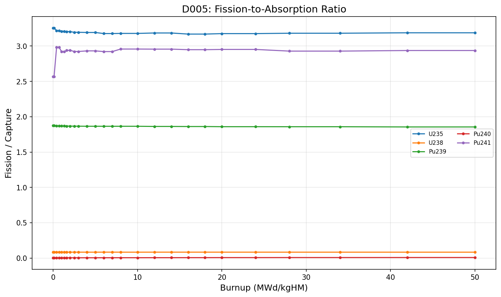

**证据表**
- 图名：D005 裂变/吸收比
- 使用字段：U235_FISS/U235_CAPT, U238_FISS/U238_CAPT, PU239_FISS/PU239_CAPT, PU240_FISS/PU240_CAPT, PU241_FISS/PU241_CAPT
- 公式或计算口径：对每个核素按 ratio = FISS / CAPT.replace(0, NaN) 复算；横轴为 burnup_MWd_kgHM；若分母为 0 或整列无有限值，则图中无线。
- 关键点数值：

| 序列 | 趋势方向 | x_start | y_start | x_end | y_end | y_max | y_min | 拐点位置 / 变化最快区间 |
|------|----------|---------|---------|-------|-------|-------|-------|------------------------|
| U235 | 波动 | 0 | 3.2549 | 50.0002 | 3.1876 | 3.2549 @ 0 | 3.1692 @ 16.0001 | 1.6000 / 0.1000→0.4000 |
| U238 | 波动 | 0 | 0.0835 | 50.0002 | 0.0836 | 0.0840 @ 6.0000 | 0.0835 @ 0 | 1.0000 / 0.1000→0.4000 |
| Pu239 | 波动 | 0 | 1.8761 | 50.0002 | 1.8555 | 1.8761 @ 0 | 1.8555 @ 42.0001 | 1.6000 / 0.1000→0.4000 |
| Pu240 | 上升 | 0 | 0.0032 | 50.0002 | 0.0081 | 0.0081 @ 42.0001 | 0.0032 @ 0 | 无 / 1.3000→1.6000 |
| Pu241 | 波动 | 0 | 2.5681 | 50.0002 | 2.9368 | 2.9816 @ 0.4000 | 2.5681 @ 0 | 0.1000 / 0.1000→0.4000 |

- 与图片视觉趋势一致性检查结果：通过（现有 `plots/D005/fission_absorption_ratio.png` 与按 `results/script/analyze_data.py` 和 `results/data_processed/data.csv` 重绘结果逐像素一致，未发现版本冲突）

> **图注**：D005 的裂变/俘获比显示多核素并行但无单条曲线突变：U235 从 3.2549 到 3.1876，Pu239 从 1.8761 到 1.8555，U238 基本维持在 0.0835 左右。Pu240 则从 0.0032 上升到 0.0081，Pu241 在 0.4000 MWd/kgHM 达到 2.9816 后末端为 2.9368。该图支持的结论是 D005 的末端临界性来自多核素共同分担，而不是某一条新生曲线完全接管；这与其 CR 末端仅 0.7167 的折中状态一致。

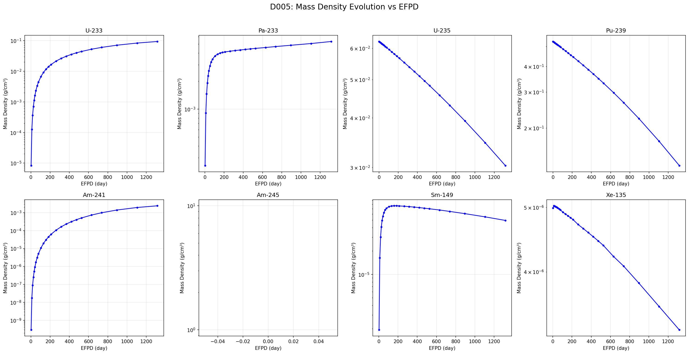

**证据表**
- 图名：D005 核素质量密度（EFPD）
- 使用字段：Mdens_U233, Mdens_Pa233, Mdens_U235, Mdens_Pu239, Mdens_Am241, Mdens_Am245, Mdens_Sm149, Mdens_Xe135
- 公式或计算口径：直接使用 EFPD 与 MASS_DENSITY_COLS；脚本仅绘制大于 0 的点并使用对数纵轴；无有效点的子图显示 No Data。
- 关键点数值：

| 序列 | 趋势方向 | x_start | y_start | x_end | y_end | y_max | y_min | 拐点位置 / 变化最快区间 |
|------|----------|---------|---------|-------|-------|-------|-------|------------------------|
| U-233 | 上升 | 0 | 0 | 1315.7947 | 0.0938 | 0.0938 @ 1315.7947 | 0 @ 0 | 无 / 157.8953→184.2111 |
| Pa-233 | 上升 | 0 | 0 | 1315.7947 | 0.0053 | 0.0053 @ 1315.7947 | 0 @ 0 | 无 / 0→2.6316 |
| U-235 | 下降 | 0 | 0.0624 | 1315.7947 | 0.0303 | 0.0624 @ 0 | 0.0303 @ 1315.7947 | 无 / 42.1053→52.6318 |
| Pu-239 | 下降 | 0 | 0.5287 | 1315.7947 | 0.1314 | 0.5287 @ 0 | 0.1314 @ 1315.7947 | 无 / 0→2.6316 |
| Am-241 | 上升 | 0 | 0 | 1315.7947 | 0.0024 | 0.0024 @ 1315.7947 | 0 @ 0 | 无 / 736.8447→894.7395 |
| Am-245 | 证据不足 | — | — | — | — | — | — | 无有效点 |
| Sm-149 | 先升后降 | 0 | 0 | 1315.7947 | 4.9532e-05 | 7.6359e-05 @ 157.8953 | 0 @ 0 | 157.8953 / 2.6316→10.5263 |
| Xe-135 | 先升后降 | 0 | 0 | 1315.7947 | 3.2726e-06 | 5.0252e-06 @ 10.5263 | 0 @ 0 | 10.5263 / 0→2.6316 |

- 与图片视觉趋势一致性检查结果：通过（现有 `plots/D005/mass_density_vs_efpd.png` 与按 `results/script/analyze_data.py` 和 `results/data_processed/data.csv` 重绘结果逐像素一致，未发现版本冲突）

> **图注**：D005 的质量密度图显示 U233 从 0 持续升到 0.0938，Pa-233 从 0 升到 0.0053，Am-241 从 0 升到 0.0024；U-235 则从 0.0624 降到 0.0303，Pu-239 从 0.5287 降到 0.1314。Sm-149 在 157.8947 EFPD 达峰 7.6359e-05、Xe-135 在 10.5263 EFPD 达峰 5.0252e-06 后回落；Am-245 无有效数据，图中对应子图为 No Data。这说明 D005 的质量从初装裂变核素持续转移到新生 U233 与次生锕系核素，但这种转移只把系统推到 keff≈1.0000、未把 CR 推过 0.9000。

---

#### D019（D 组 CR 最高，高转化率代表）

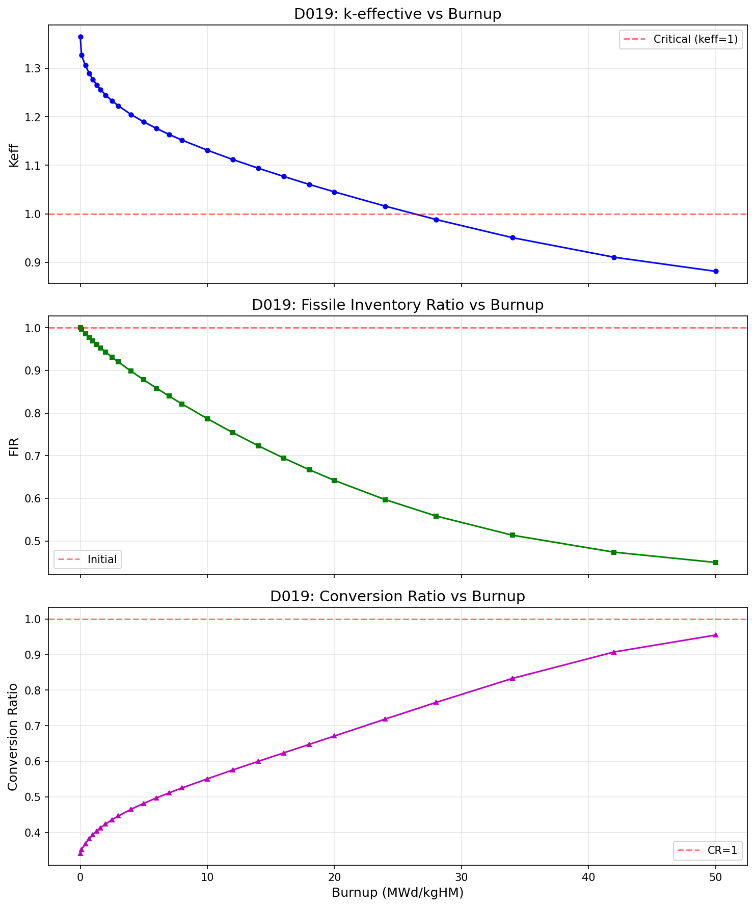

**证据表**
- 图名：D019 keff-FIR-CR
- 使用字段：ANA_KEFF, conversion_ratio, Mdens_U233, Mdens_U235, Mdens_Pu239, Mdens_Pu241
- 公式或计算口径：Keff/CR 直接取 CSV；FIR(t) = (Mdens_U233 + Mdens_U235 + Mdens_Pu239 + Mdens_Pu241)_t / 同一和式在步 0 的初值；横轴为 burnup_MWd_kgHM。
- 关键点数值：

| 序列 | 趋势方向 | x_start | y_start | x_end | y_end | y_max | y_min | 拐点位置 / 变化最快区间 |
|------|----------|---------|---------|-------|-------|-------|-------|------------------------|
| KEFF | 下降 | 0 | 1.3648 | 50.0002 | 0.8814 | 1.3648 @ 0 | 0.8814 @ 50.0002 | 无 / 0→0.1000 |
| FIR | 下降 | 0 | 1.0000 | 50.0002 | 0.4496 | 1.0000 @ 0 | 0.4496 @ 50.0002 | 无 / 0→0.1000 |
| CR | 上升 | 0 | 0.3406 | 50.0002 | 0.9546 | 0.9546 @ 50.0002 | 0.3406 @ 0 | 无 / 0→0.1000 |

- 与图片视觉趋势一致性检查结果：通过（现有 `plots/D019/keff_fir_cr.png` 与按 `results/script/analyze_data.py` 和 `results/data_processed/data.csv` 重绘结果逐像素一致，未发现版本冲突）

> **图注**：D019 的 keff 从 1.3648 降到 0.8814，FIR 从 1.0000 降到 0.4496，CR 从 0.3406 升到 0.9546。末端 CR 已超过 0.9000，但 keff 末端只有 0.8814。因此 D019 可以作为高转化上限样本，但不能作为满足末端临界约束的解。

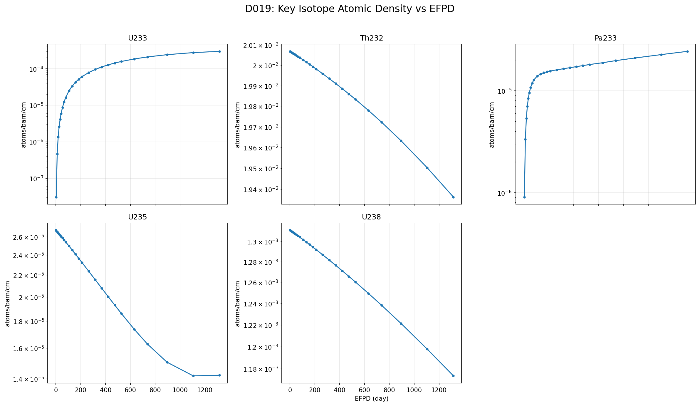

**证据表**
- 图名：D019 核素库存
- 使用字段：Adens_U233, Adens_Th232, Adens_Pa233, Adens_U235, Adens_U238
- 公式或计算口径：直接使用 EFPD 与 KEY_ADENS = [Adens_U233, Adens_Th232, Adens_Pa233, Adens_U235, Adens_U238]；脚本仅绘制大于 0 的点并使用对数纵轴。
- 关键点数值：

| 序列 | 趋势方向 | x_start | y_start | x_end | y_end | y_max | y_min | 拐点位置 / 变化最快区间 |
|------|----------|---------|---------|-------|-------|-------|-------|------------------------|
| Adens_U233 | 上升 | 0 | 0 | 1315.7947 | 2.9895e-04 | 2.9895e-04 @ 1315.7947 | 0 @ 0 | 无 / 157.8953→184.2111 |
| Adens_Th232 | 下降 | 0 | 0.0201 | 1315.7947 | 0.0194 | 0.0201 @ 0 | 0.0194 @ 1315.7947 | 无 / 1105.2684→1315.7947 |
| Adens_Pa233 | 上升 | 0 | 0 | 1315.7947 | 2.4291e-05 | 2.4291e-05 @ 1315.7947 | 0 @ 0 | 无 / 0→2.6316 |
| Adens_U235 | 先降后升 | 0 | 2.6758e-05 | 1315.7947 | 1.4210e-05 | 2.6758e-05 @ 0 | 1.4174e-05 @ 1105.2684 | 1105.2684 / 42.1053→52.6318 |
| Adens_U238 | 下降 | 0 | 0.0013 | 1315.7947 | 0.0012 | 0.0013 @ 0 | 0.0012 @ 1315.7947 | 无 / 1105.2684→1315.7947 |

- 与图片视觉趋势一致性检查结果：通过（现有 `plots/D019/inventory_vs_efpd.png` 与按 `results/script/analyze_data.py` 和 `results/data_processed/data.csv` 重绘结果逐像素一致，未发现版本冲突）

> **图注**：D019 的 U233 从 0 持续升到 2.9895e-04，Th232 从 0.0201 降到 0.0194，Pa233 从 0 升到 2.4291e-05。U235 先降后升：在 1105.2632 EFPD 降到最小值 1.4174e-05，末端回到 1.4210e-05；U238 则继续缓降到 0.0012。这些趋势解释了 D019 为何能把 CR 末端推到 0.9546：转化确实更强，但新增库存仍不足以把 keff 末端维持在 1.0000 以上。

---

## 7. 结论与后续敏感性分析建议

### 7.1 核心结论

1. **CR-keff 根本矛盾**：在现有参数空间内，不存在同时满足 CR末≥0.9 且 keff末≥1.0 的设计点。CR 的提升以牺牲 keff 末端裕量为代价，这是钍基 PWR 优化中最根本的物理矛盾。

2. **A 组结论**：高 Th 比例（A007–A012）可实现 FIR>1（净增殖），CR 稳定在 1.04–1.05，但 keff 初值次临界，需要启动策略。这种方案适合作为"增殖堆"而非直接作为商业 PWR 运行。

3. **B 组结论**：U233 初装增大虽能提高临界维持能力，但 CR 随 U233 浓度单调下降（B001: 0.76 → B012: 0.07）。B001 是 B 组唯一折中点，其附近值得进一步精细搜索。

4. **C 组结论**：C001 代表 Pu-Th 体系的转化上限（CR=0.88），但无法保临界；C002 是能保临界的最低 Pu 配方（CR=0.50）。C 组的 CR-keff 折中区域比 B 组更宽，是多目标优化的潜力区域。

5. **D 组结论**：D 组三元体系提供了最丰富的设计自由度。D005（keff末≈1.0，CR=0.72）和 D019（CR=0.955，keff末=0.881）共同界定了可行参数空间的 Pareto 前沿。D 组是后续 DoE 采样的首选平台。

6. **毒物影响**：Sm149 和 Xe135 在所有算例中都迅速达到准静态，是全局性的反应性负贡献源（约 -500 至 -1500 pcm），但不是区分各算例性能差异的主要因素；主要差异源于初始燃料组成。

### 7.2 后续敏感性分析建议

| 优先级 | 参数 | 建议范围 | 理由 |
|--------|------|---------|------|
| ★★★★★ | Th_level | 0.70–0.95 | 全局最关键，直接决定 CR 上限 |
| ★★★★ | Pu_level（D 组） | 0.04–0.08 | keff 的主要调节手段 |
| ★★★ | U235_enrichment（D 组） | 0.02–0.05 | 次要 keff 调节，影响初始反应性 |
| ★★★ | U233_enrichment（B 组） | 0.05–0.20 | B 组 CR 对此参数极度敏感 |
| ★★ | Th × Pu 交互项 | D 组参数面 | D 组 Pareto 前沿由此决定 |
| ★ | 慢化剂温度系数 | — | 建议在最优点附近做扰动分析 |

推荐采用 **拉丁超立方采样（LHS）** 在 D 组参数空间中生成 100–200 个新算例，再以 **NSGA-II 多目标遗传算法** 搜索 CR-keff Pareto 前沿，目标函数为：
- 最大化 CR末
- 最大化 min(keff末, 1.0)（惩罚次临界）

---

*报告生成时间：2026-05-13*  
*图表路径：`plots/`*  
*脚本：`results/script/analyze_data.py`*
